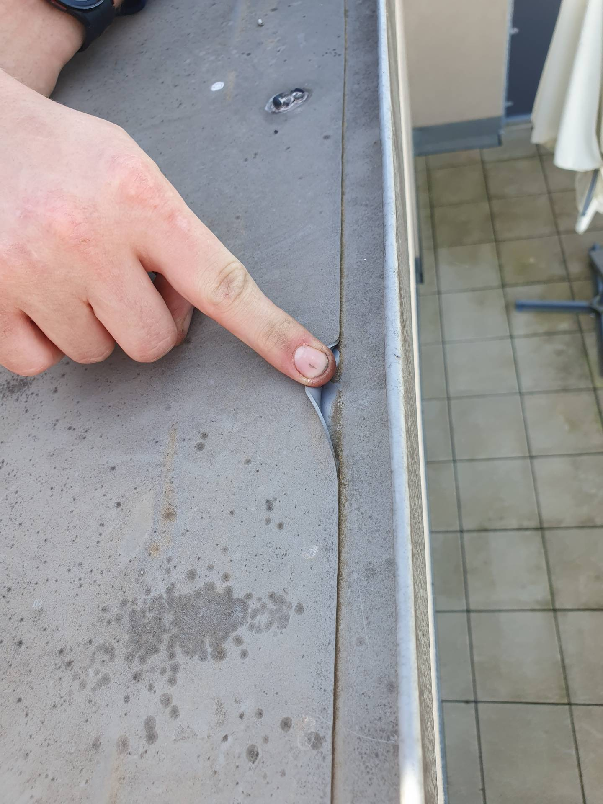
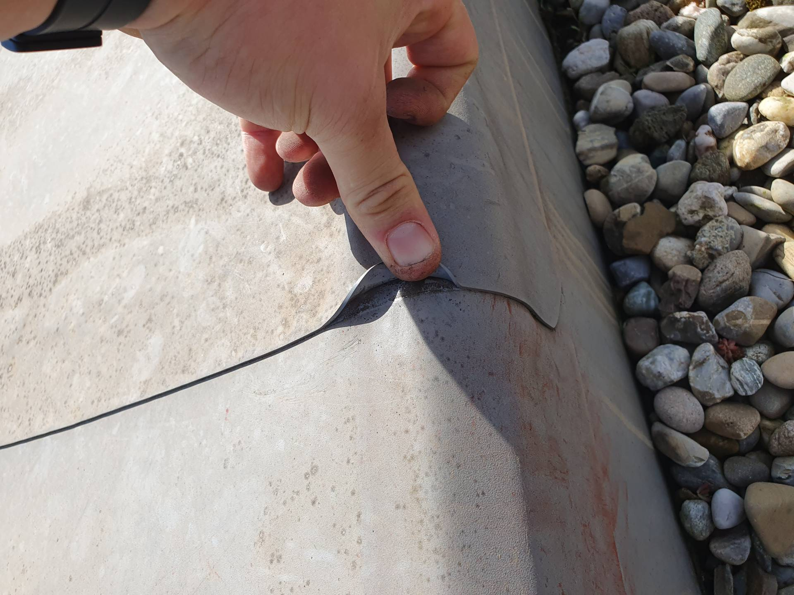
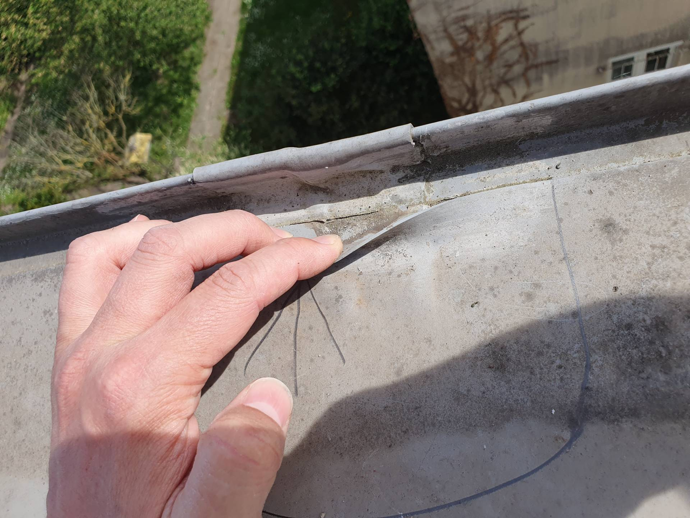

# A6 &ndash; Folienabdichtung auf Attika löst sich an zahlreichen Stellen bei allen Häusern

_[&lt; zurück](../index.md)_

_Bauträger Vorgangsnummer: 8424-0391 (WEG) + 8424-0388 (Haus 9)_



## Aktueller Stand (08.08.2024)

Der Bauträger hat noch nicht auf die Meldung der Mängel reagiert.
Die ablösende Folienabdichtung ist noch vorhanden und sichtbar.

## Beschreibung

Bei der Dachwartung wurde festgestellt, dass sich die Folienabdichtung auf der Attika bei beiden Häuserreihen an vielen Stellen löst.

Desweiteren sollte geklärt werden, ob die Ausführung in der Form zulässig ist. Die Folie ist ohne weiteren Schutz direkt auf die Attikaverkleidung geschweißt.

## Fotos

