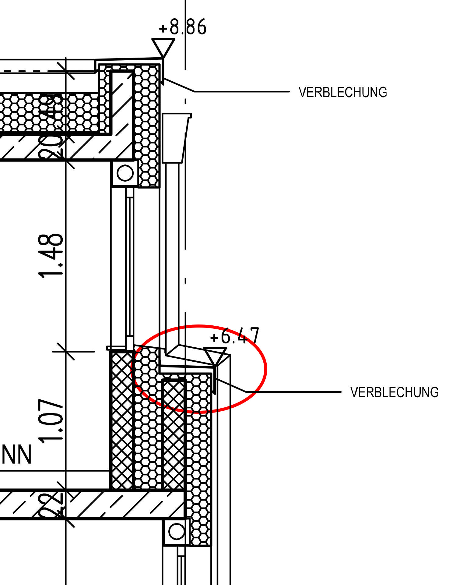
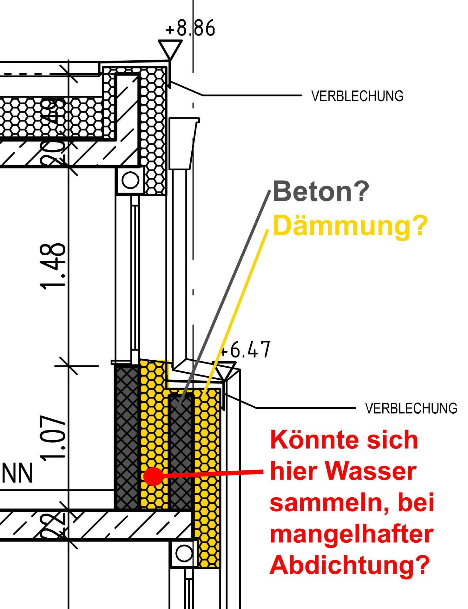
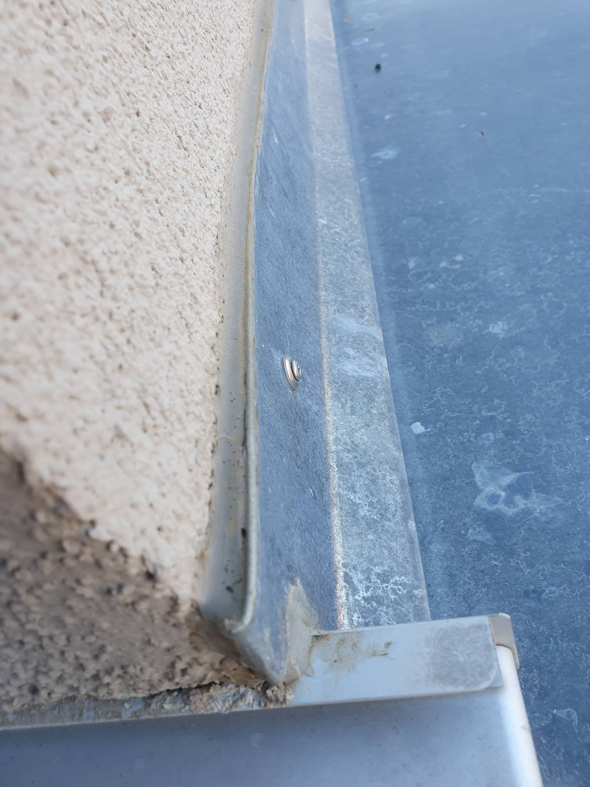
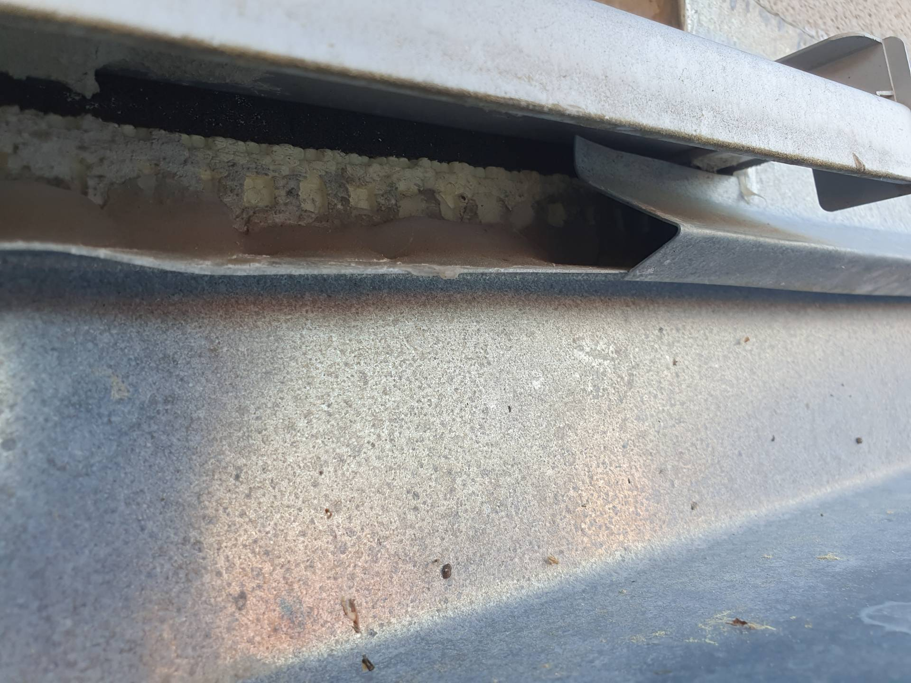
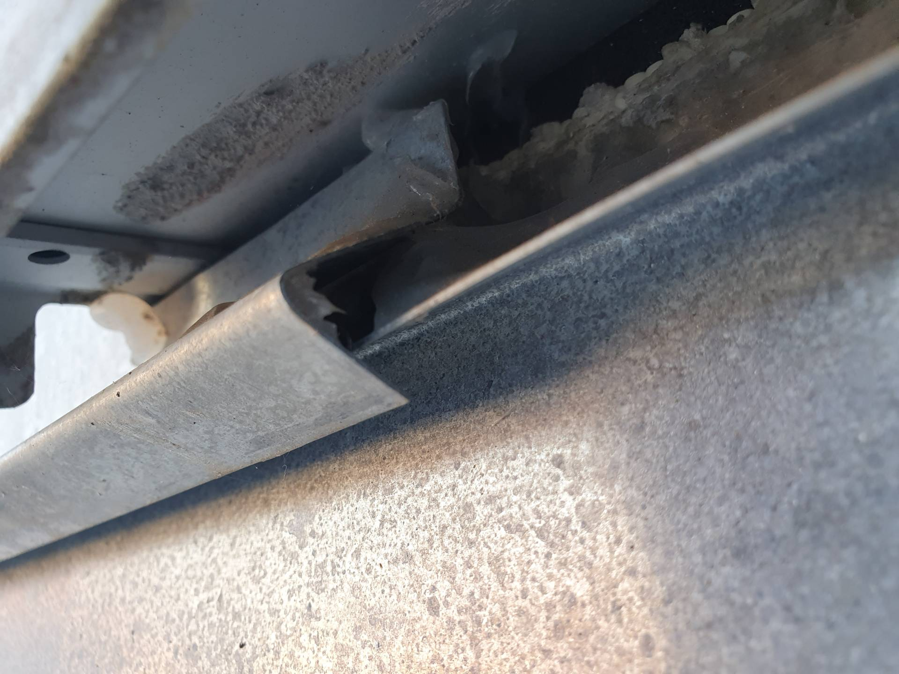

# A16 &ndash; Wasserschaden via Blechverkleidung Sims Ost (Haus 3)

_[&lt; zurück](../../index.md)_



## Aktueller Stand (08.08.2024)

Bei Haus 1-7 wurde die komplette Blechverkleidung erneuert. Hier sollte geklärt
werden, ob die neue Ausführung in Ordnung ist (Wartungsfuge, etc.).

Bei Haus 8-13 wurde nichts gemacht. Es wurde aber auch kein Mangel gemeldet,
da bisher kein Schaden aufgetreten ist. Hier sollte geprüft
werden, ob die Ausführung in Ordnung ist (Wartungsfuge, etc.).

## Beschreibung

Das zweite Stockwerk beider Häuserreihen ist etwas kleiner als die Stockwerke darunter. In westlicher Richtung ist die Dachterrasse und in östlicher Richtung ist das Stockwerk leicht versetzt und eine ca. 40cm breiter Sims erstreckt sich über die komplette Häuserreihe. Dieses Sims ist mit Blech verkleidet ("Verblechung" im Plan).

Bei Haus 3 gab es einen Wasserschaden mit Schimmel in einem der östlichen Räume im 1. OG, da Wasser über das Sims eingedrungen ist und hinter der Dämmung die Wand heruntergelaufen ist. Es hat sich herausgestellt, dass das Sims ein Gefälle Richtung Haus hatte, sich Wasser gestaut und über die Blechverfalzung eingedrungen ist.

Bei der vorderen/westlichen Häuserreihe wurde daraufhin das komplette Sims erneuert. Bei der hinteren/östlichen Häuserreihe ist das nicht erfolgt.
Es ist zu ermitteln, ob bei der hinteren Reihe ebenfalls ein Mangel vorliegt. Außerdem ist zu untersuchen, ob die Ausführung (auch der neuen Blechverkleidung der vorderen Reihe), korrekt ausgeführt ist.

Zum Beispiel ist die obere Metallkante weiterhin mit einem Dichtstoff abgedichtet. Es ist fraglich, ob in dieser Höhe eine unzugängliche Wartungsfuge zulässig ist, zwischen Metall und Fassade, der Witterung und hohen Temperaturunterschieden ausgesetzt.\
Es stellt sich auch die Frage wohin Wasser (ab)fließt, sollte die Wartungsfuge rissig werden, was früher oder später der Fall sein wird.

Außerdem sollte geklärt werden, was mit Wasser passieren würde, welches zwischen die zwei Betonmauern (siehe Plan) eindringt.
Wohin wird das Wasser ablaufen, oder sammelt es sich in diesem Bereich!?

## Fotos

26.09.2023 Erneuerung vordere Häuserreihe

Zum Vergleich aktuelle Fotos der hinteren Reihe (ursprünglicher Zustand):

23.04.2024 (Foto von Haus 12) Wartungsfuge zulässig? Was passiert, wenn sie undicht wird?

23.04.2024 (Foto von Haus 12) ausreichend Schlagregengeschützt?

23.04.2024 (Foto von Haus 12) ausreichend Schlagregengeschützt?

