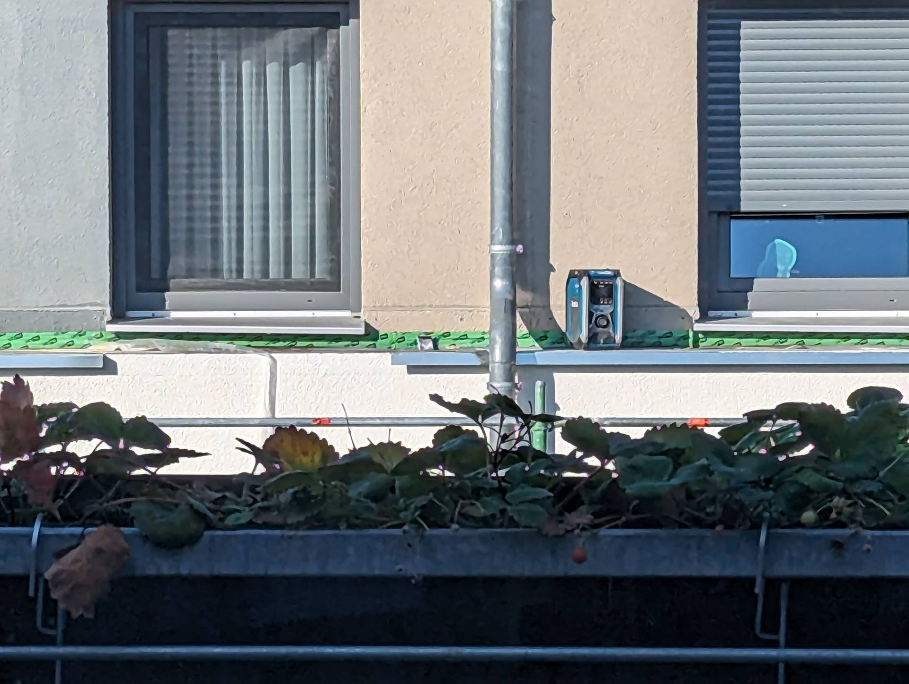

# A16 &ndash; Wasserschaden via Blechverkleidung Sims Ost (Haus 3)

_[&lt; zurück](../../index.md)_



Das zweite Stockwerk beider Häuserreihen ist etwas kleiner als die Stockwerke darunter. In westlicher Richtung ist die Dachterrasse und in östlicher Richtung ist das Stockwerk leicht versetzt und eine ca. 40cm breiter Sims erstreckt sich über die komplette Häuserreihe. Dieses Sims ist mit Metall verkleidet.

Bei Haus 3 gab es einen Wasserschaden mit Schimmel in einem der östlichen Räume im 1. OG, da Wasser über das Sims eingedrungen ist und hinter der Dämmung die Wand heruntergelaufen ist.

Bei der vorderen/westlichen Häuserreihe wurde daraufhin das komplette Sims erneuert. Bei der hinteren/östlichen Häuserreihe ist das nicht erfolgt. Hier ist zu ermitteln, ob alles korrekt ausgeführt wurde, oder ob auch hier ein Mangel vorliegt.

Zum Beispiel ist die obere Metallkante mit einem Dichtstoff abgedichtet. Es ist fraglich, ob in dieser Höhe eine unzugängliche Wartungsfuge zulässig ist.

## Fotos

26.09.2023 Erneuerung vordere Häuserreihe

