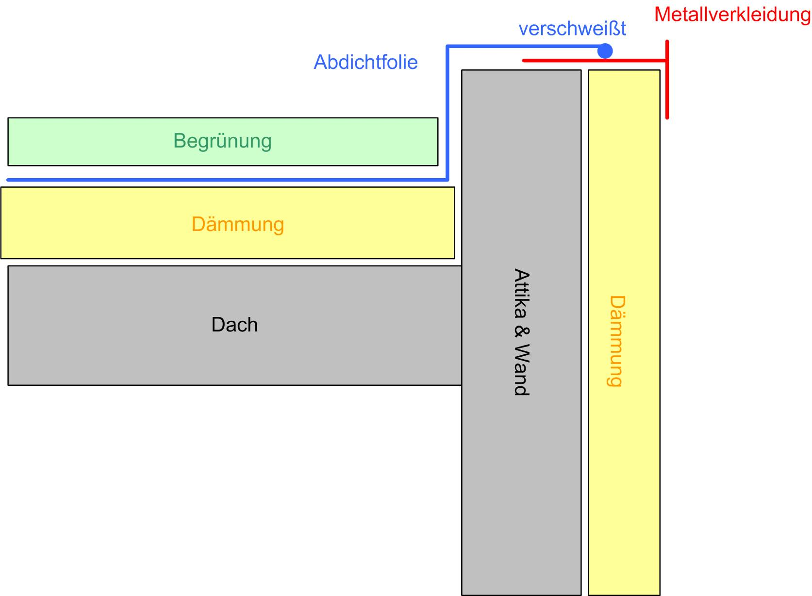
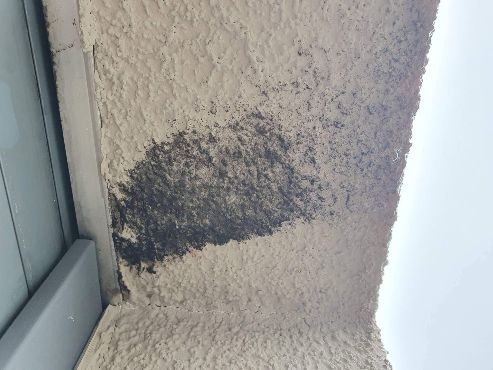
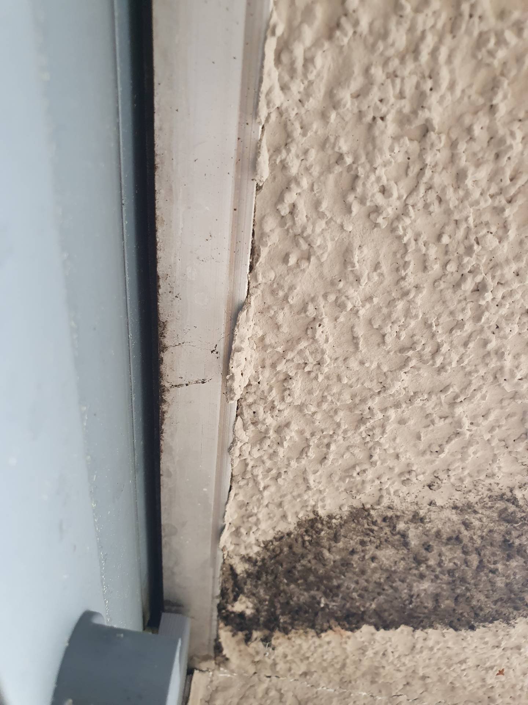
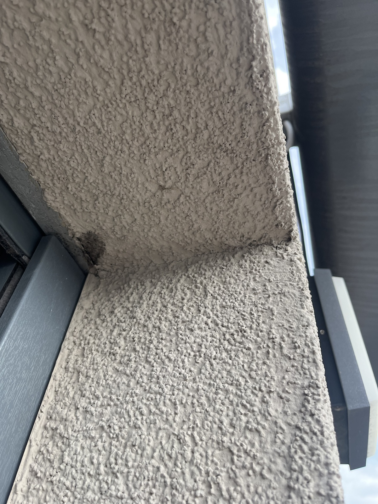
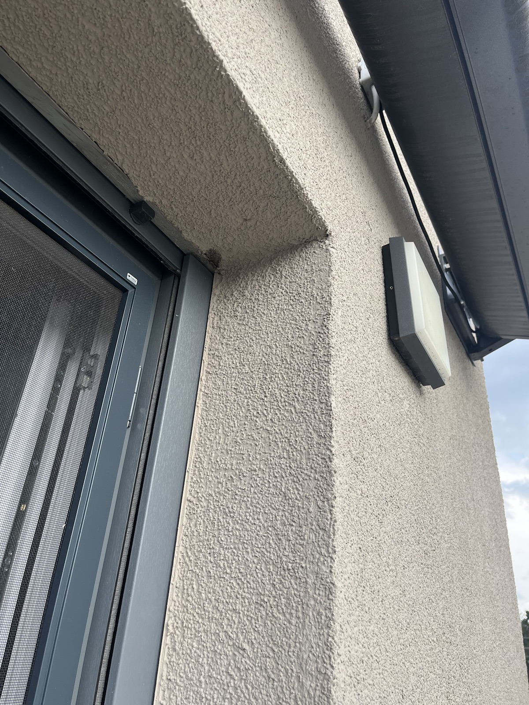

# 8424-0382 &ndash; Schimmel Fassade Haus 10

_[&lt; zurück](../../index.md)_

_Bauträger Vorgangsnummer: 8424-0382 (Haus 10), 8424-0384 (Haus 13), ? (Haus 12)_



## Aktueller Stand (08.08.2024)

Die Flecken sind (meines Wissens) immer noch sichbar und der Bauträger hat noch
bei keinem der drei Häuser reagiert.

## Beschreibung

Im Bereich des Rollladens zur Dachterrasse sind schwarze Stellen aufgetreten.
Ein ähnliches Schadensbild ist sowohl bei Haus 10 als auch Haus 13 auf der Dachterrasse aufgetreten.
Bei Haus 12 ist es am Badezimmerfenster Richtung Osten aufgetreten.

Sollte der Grund Wasser hinter der Dämmung sein, hieße dass, das Dach oder die Attika wäre undicht.

Siehe auch [A6 &ndash; Folienabdichtung auf Attika löst sich an zahlreichen Stellen bei allen Häusern](../../A6/index.md)

_Mutmaßlicher vereinfachter Aufbau Dach Attika und Fassade:_

## Fotos Haus 10

2024-04-21

2024-04-21

## Fotos Haus 13

