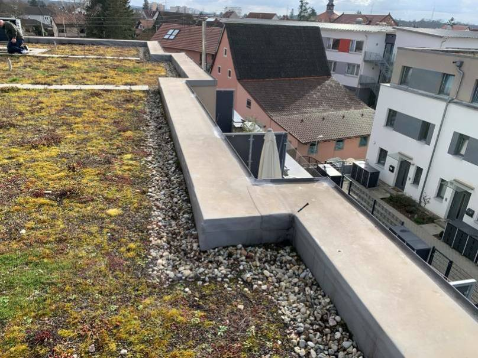
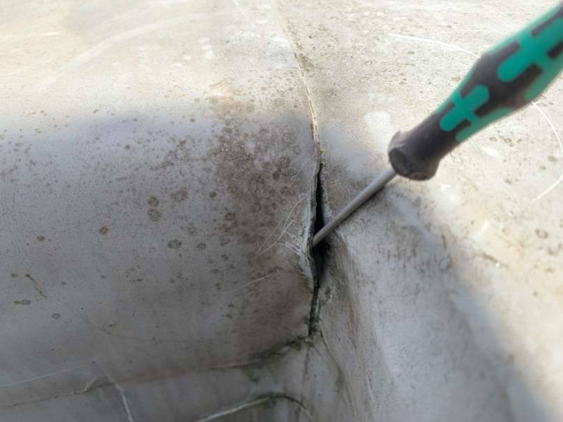
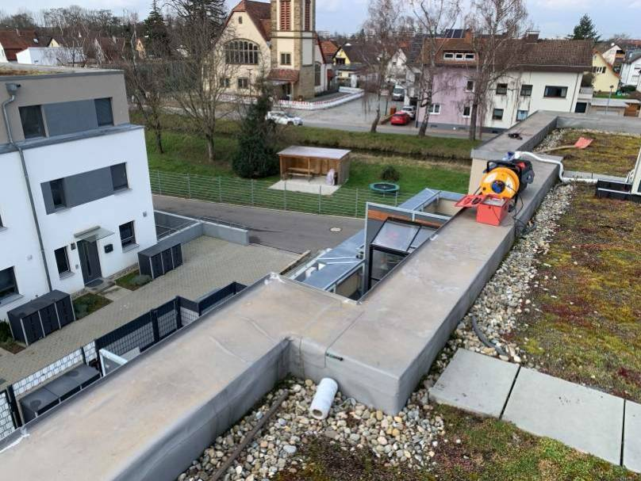
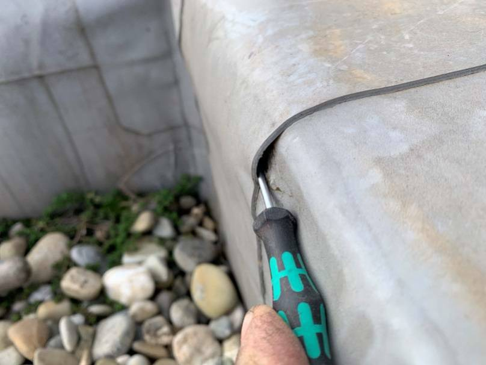
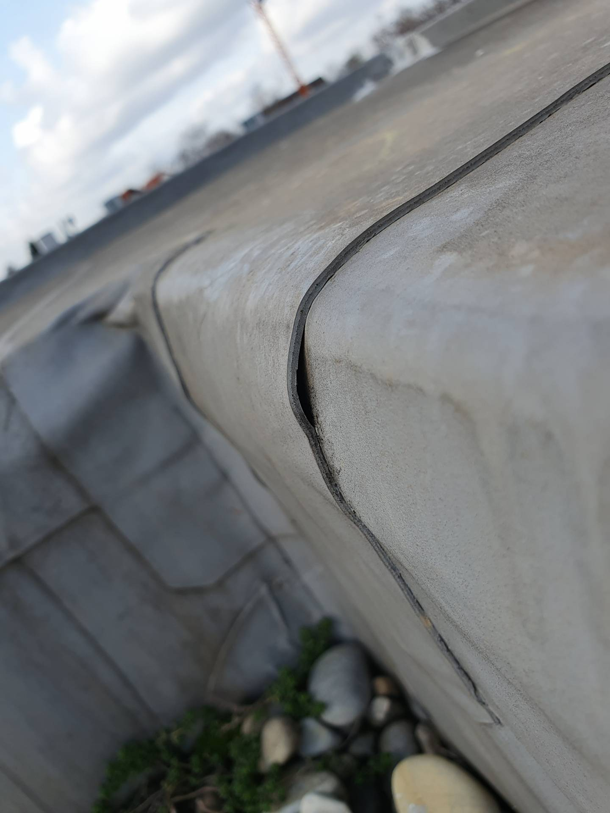

# A15 &ndash; 2 Leckagen Dach, Haus 10

 _Bauträger Vorgangsnummer: 8424-0395_

_[&lt; zurück](../../index.md)_



## Aktueller Stand (08.08.2024)

Die gefundenen Leckagen wurde abgedichtet.
Es wurde keine Öffnung und keine Trocknung vorgenommen.

## Historie

Am 23.02.2023 wurde eine Leckortung bei den Flachdächern beider Häuserreihen
mittels Potenzialausgleichsmessungen durchgeführt.
Bei Haus 10 wurden 2 Leckagen gefunden.
Hier das zugehörige [Untersuchungsprotokoll] (zugriffsgesichert).

Der Bauträger hat daraufhin die Leckagen abdichten lassen, ohne allerdings
eine Öffnung vornehmen zu lassen, um zu untersuchen, wieviel Wasser eingedrungen ist.
Eine Trocknung der Dämmschicht hat dementsprechend auch nie stattgefunden.

Die Eigentümer wurde außerdem nie informiert.
Die Eigentümer haben am 22.07.2024 den Mangel nachgemeldet - Vorgangsnummer 8424-0395.

## Fotos

2023-02-23 (aus Leckortungsprotokoll)

2023-02-23 (aus Leckortungsprotokoll)

2023-02-23 (aus Leckortungsprotokoll)

2023-02-23 (aus Leckortungsprotokoll)

2023-02-23 (Haus 10)

[Untersuchungsprotokoll]: https://drive.google.com/drive/folders/1Bhk95p84AaMtnwnOoj_zFdLu95Lqjsnd?usp=drive_link
