# 8424-0327 &ndash; Wasserschaden Dachterrasse, 2. OG und 1. OG, Haus 9

_[&lt; zurück](../../index.md)_

_Bauträger Vorgangsnummer: 8424-0327_



Bei der Sanierung wurden [folgende Systematischen Mängel](../../SystematischeMängel/index.md) identifiziert.

## Stand 30.06.2025

Auf den Dachterrassen von Haus 8 und 9 wurde auf der erneuerten Folienabdichtung nun auch neues Vlies
verlegt, der bestehende Splitt verteilt und die Platten wieder verlegt.

Zum Vorgehen:
- Es wurde zuerst die Dachterrasse von Haus 9 gemacht, da das ganze Material (Splitt, Platten,...) auf der Dachterrasse von Haus 8 aufgehäuft lag.
- Das neue Vlies wurde diesmal ausreichend hoch verlegt.
- Splitt wurde vom Haufen bei Haus 8 auf der Dachterrasse von Haus 9 verteilt. Meine Anmerkung, dass es schwer wird, den Splitt wieder gleichmäßig auf beide Terrassen aufzuteilen zu verteilen wurde abgetan.
- Zusätzlich wurde später bei Haus 8 zusätzlicher neuer Splitt hinzugeführt.
- Die Platten wurden teilweise geschnitten, da die genauen Positionen nicht mehr zuzuordnen waren.
- An der Fensterfront zwischen Gitter und Platten entstand so ein breiterer Spalt als vorher, der mit Steinen gefüllt wurde.

Probleme aus unserer Sicht:
- Die Terrassen sind insgesamt um einige Zentimeter höher.
  Vor allem an den Fensterfronten ist das ein Problem, da die Platten teilweise bis auf Höhe der Entwässerungsschlitze reichen!
  Der Abstand bis zur Kante des Rahmens ist damit ebenfalls deutlich geringer.
  Bei Starkregen ist zu erwarten, dass Wasser (schneller) über den Rahmen ins Gebäude eindringen kann.

## Stand 12.11.2024

Der Bauträger hat sich entschieden die Folienabdichtungen der Dachterrassen von Haus 8 und 9 komplett erneuern zu lassen.
Dafür wurden alle Platten, Splitt, Vlies, Folien und Dämmplatten entfernt (es wurde auf einer Dachterrasse angefangen und das Material auf die jeweils andere zwischengelagert).

Zwischen Haus 8+9 und 9+10 wurden Schotts (in Form einer hochgezogenen Bitumenbahn) hergestellt.

Gefundene Mängel:
- Viele Dämmplatten waren, wie zu erwarten war, komplett durchnässt. Diese Dämmplatten wurden ausgetauscht, nur wenig feuchte wurden beibehalten.
- Auch die Bitumenschicht hatte an mehreren Stellen Leckagen und wurde abgedichtet.
- Die "Abdichtungen" der Stromkabel durch die Bitumenschicht haben teilweise schon Risse aufgewiesen.
- Im Bereich der Rollladenleisten von Haus 8 (Haus 9 wurde vorher schon korrigiert und daher etwas besser) wurde wie erwartet ebenfalls eine unzureichende, zu tiefe, oben offene Abdichtung festgestellt.

Durchgeführte Arbeiten:
- Die Leckagen in der Bitumenschicht wurden ausgebessert.
- Steinwolle komplett mit Wasser vollgesaugt (Haus 8+9 und Haus 9+10).
- Nasse Dämmplatten wurden getauscht.
- Die Folienabdichtung wurde neu hergestellt (bis zum unteren Randbereich).
  Es wurde mit Hitze verschweißt.
- Zusätzlich wurde am Rand mit Flüssigkunststoff abgedichtet.
- Im Bereich der Rollladenleisten wurde mit Folie und Flüssigkunststoff höher als zuvor abgedichtet.
- Die Bitumenschicht und Folie wurde an den Rahmen der Fensterfront geschweißt und mit Flüssigkunststoff abgedichtet.

Mögliche weitere/neue Probleme:
- Es wurde keine Metallschiene mehr verwendet, um die Folie an der Fensterfront zu befestigen.
  Hält das dauerhaft?
- Vor dem Wasserablauf ist die Folie 2-3 Zentimeter tiefer als der Ablauf wodurch sich eine Pfütze bildet und Wasser dauerhaft steht (bis es verdunstet).
  Ist das OK?
- Die Steinwolle der Dachterrasse zwischen Haus 9 und 10 ist nachweislich weiterhin durchnässt!
  Diese wurde nicht ausgetauscht, da nur ein Auftrag für Haus 8 + 9 vorlag. Stattdessen wurde ein Schott gebaut.
  Es ist davon auszugehen, dass mindestens bei Haus 10 ebenfalls die Dämmplatten (zusätzlich zur definitiv durchnässten Steinwolle) nass sind.

Vlies, Splitt und Platten wurden nicht verlegt.
Diese lagen monatelang auf einem Haufen auf der Dachterrasse von Haus 8.

## Stand 10.09.2024

Das erneut eingeschaltete Trocknungsgerät hat innerhalb weniger Stunden erneut
3cm Wasser am Boden der Dämmschicht angesaugt. Das bedeutet es dring weiterhin Wasser
von irgendwo in die Dämmschicht ein.

2024-09-11
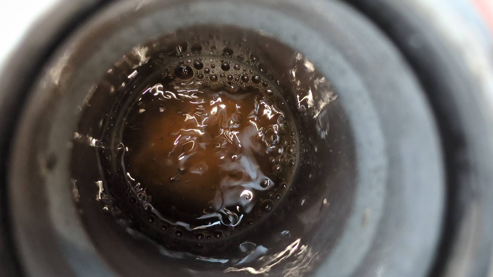

## Stand 08.08.2024

Der Innenbereich ist erledigt. Das Loch durch die Wand (Brennstellenkabel), durch
das Wasser eingedrungen ist, wurde nicht abgedichtet.

Die Rollladenleisten wurden entfernt, zusätzliche Folie bis weiter oben verschweißt
und mit Flüssigkunststoff abgedichtet.\
Die Rollladenleisten wurden erneuert. Dafür musste der Putz ca. 1cm aufgeschnitten werden.
Es wurde neu verputzt. In ein paar Wochen wird gestrichen.

Außen sind immer noch zwei Kaldomate und Trocknungsgeräte
installiert. Die Trocknung ist aktuell aus. Nach Regen stand anfangs wieder 1cm Wasser
im rechten Kaldomat. Seit mehreren Wochen ist es allerdings trocken.\
Der Bauträger reagiert seit April 2024 nicht mehr auf Anfragen. Auch die
Trocknungsfirma erreicht niemanden.

## Beschreibung

- [8424-0327 – Wasserschaden Dachterrasse, 2. OG und 1. OG, Haus 9](#8424-0327--wasserschaden-dachterrasse-2-og-und-1-og-haus-9)
  - [Stand 30.06.2025](#stand-30062025)
  - [Stand 12.11.2024](#stand-12112024)
  - [Stand 10.09.2024](#stand-10092024)
  - [Stand 08.08.2024](#stand-08082024)
  - [Beschreibung](#beschreibung)
  - [Weitere Historie](#weitere-historie)
  - [Fotos](#fotos)

Bei Haus 9 lief 2022 Wasser unter die Folienabdichtung der Dachterrasse und über ein Loch in der Wand (für Stromkabel) ins Haus, auf den Betonboden des 2.OG, bis zum Treppenhaus und hat dort die Trockenbauwände durchnässt.

Aktueller Stand (22.07.2024):
- Innen wurde alles getrocknet und wiederhergestellt.
- Außen wurde sehr lange getrocknet, es trat nach Regenereignissen weiter Wasser ein (teils 1cm stehendes Wasser). Seit ein paar Wochen ist es relativ trocken und höchstens leicht feucht nach Regen.
- Seit April 2024 meldet sich der Bauträger nicht mehr auf Anfragen zu dem Wasserschaden.

[_Siehe ähnlicher Wasserschaden bei Haus 2 (A9)_](../A9/index.md)\
[_Siehe ähnlicher Wasserschaden bei Haus 3 (A10)_](../A10/index.md)

## Weitere Historie

Hier die meisten Ereignisse bzgl. der Wasserschadens über die Dachterrasse von Haus 9.
Mails, etc. die nichts am Verlauf geändert haben wurden weggelassen.

| Datum | Ereignis |
| ----- | -------- |
| 19.10.2022 | Meldung Wasserschaden im Flur/Treppenhaus |
| 25.10.2022 | Leckortung: Wasser kommt über Dachterrasse |
| 04.11.2022 | Sachverständigentermin (vom Eigentümer beauftragt) |
| 22.11.2022 | Trockenbauwände innen entfernt |
| 24.02.2022 | Dachdecker: Rollladenleisten gekürzt, Folie abgedichtet (1. Versuch), Folie + Dämmung geöffnet, Wasser festgestellt.
| 28.02.2022 | Rollladenbauer stellt fest: Folie immer noch nicht dicht |
| 03.04.2023 | Dachdecker + Rollladenbauer: Rollladenschienen entfernt, Folie abgedichtet mit Flüssigkunststoff, 2 Kaldomate (HT-Rohre) installiert |
| 04.04.2024 | Trocknungsgeräte Innen und Außen installiert |
| 11.05.2023 | Innen trocken. Außen weiterhin stehendes Wasser! |
| 18.09.2023 | Leckortung mittels Potenzialausgleichsmessungen über die komplette Dachterrassenfläche: 2 Schnitte bei Haus 9, 1 Leckage bei Haus 11 |
| 22.09.2023 | Dachdecker: Abdichtung Leckagen |
| 22.11.2023 | Immer noch 1-2cm stehendes Wasser in Dämmung |
| 13.12.2023 | Innenbereich komplett wiederhergestellt |
| 02.01.2024 | Trocknung abgebaut (wegen Winter), immer noch feucht, Trocknung im Frühjahr empfohlen |
| 04.03.2024 | Trocknungsgeräte außen angeschlossen |
| 08.03.2024 | Stehendes Wasser mehrere Zentimeter hoch. Undichtheit an HT-Rohren entdeckt und abgedichtet. |
| 12.04.2024 | Weitere Leckage an HT-Rohren entdeckt |
| 24.04.2024 | Dachdecker: Komplettabdichtung HT-Rohre |
| 02.05.2024 | War inzwischen trocken. Gießkannentest: Es wird Innen wieder feucht. |
| 09.06.2024 | Zwischenzeitlich trocken, aber nach Regenphase wieder 1cm Wasser, nur im rechten Rohr! |
| 11.09.2024 | Zwischenzeitlich trocken, aber nach Sommerferien wieder 3cm Wasser, nur im rechten Rohr! |

Es wurden also über die Zeit mehrere Leckagen gefunden:

1. Im Bereich der Rollladenleisten, da diese schon montiert waren, als abgedichtet wurde.
2. Zwei Schnitte in der Folie bei Haus 9 + 1 kleines Loch in der Foliennaht bei Haus 11
3. HT-Rohr nicht ausreichend abgedichtet
4. Folie um HT-Rohr undicht, nicht richtig verschweißt.
5. Es tritt weiterhin Wasser ein... woher?

Desweiteren wurden auf dem Flachdach Leckagen/Mängel gefunden:

1. Zwei Löcher (Ecke Folie unzureichend verschweißt) bei Haus 8.
2. An 24 Stellen löst sich die Folie auf der Attika (bei Dachwartung festgestellt).

## Fotos

2023-02-24
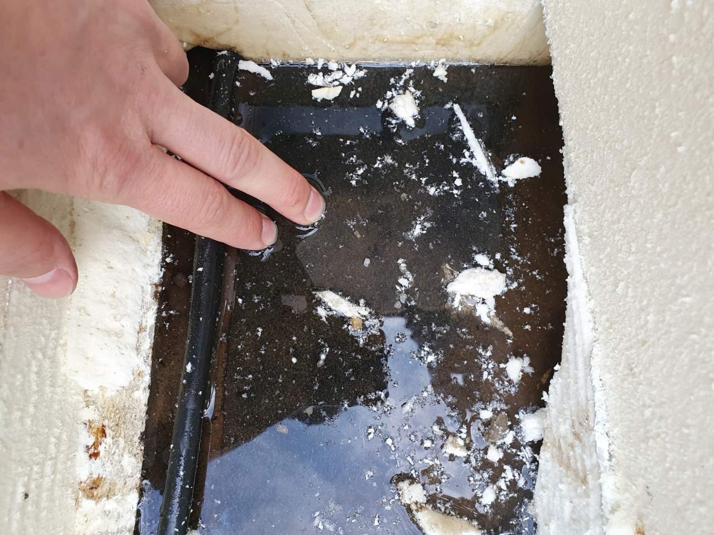

2023-02-24
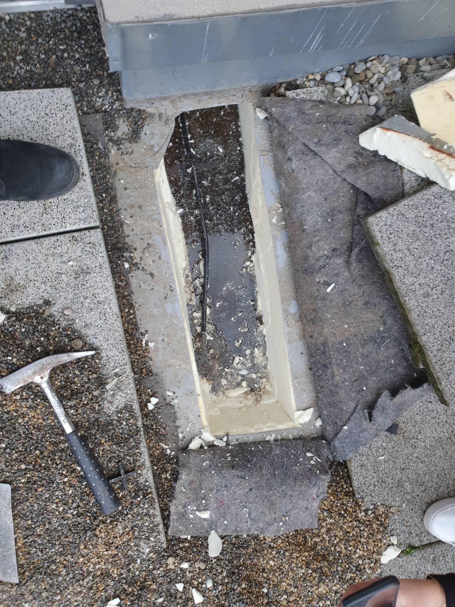

2023-02-24 (Loch durch Wand ist höher als die Folie - wurde nicht weiter geöffnet - Loch nicht abgedichtet)
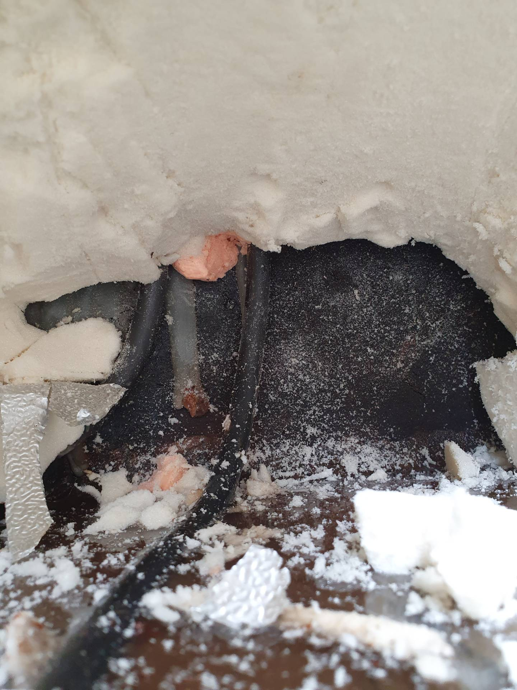

2023-04-03
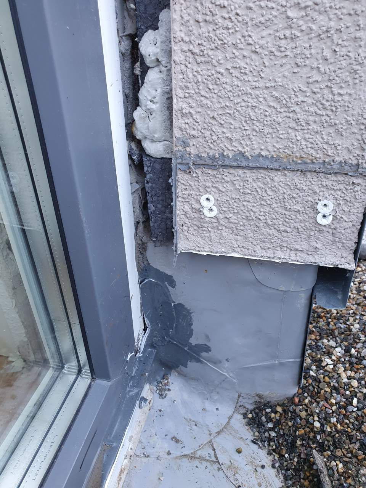

2023-04-03
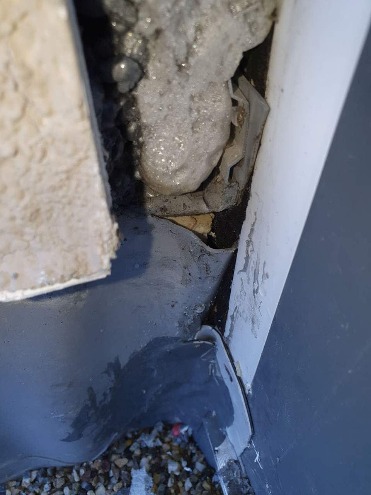

2023-04-03
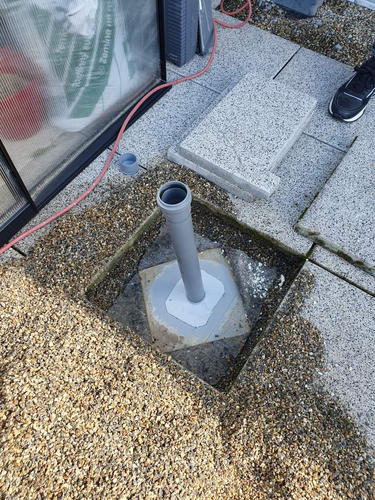

2023-09-19
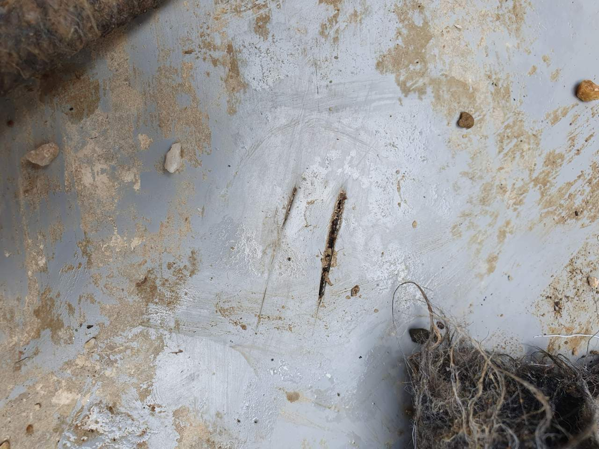

2024-04-24
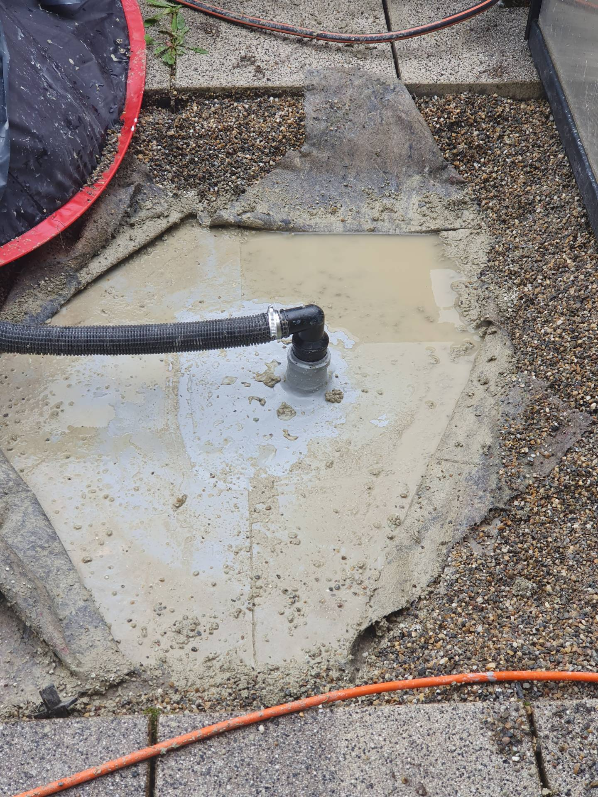

2024-06-06
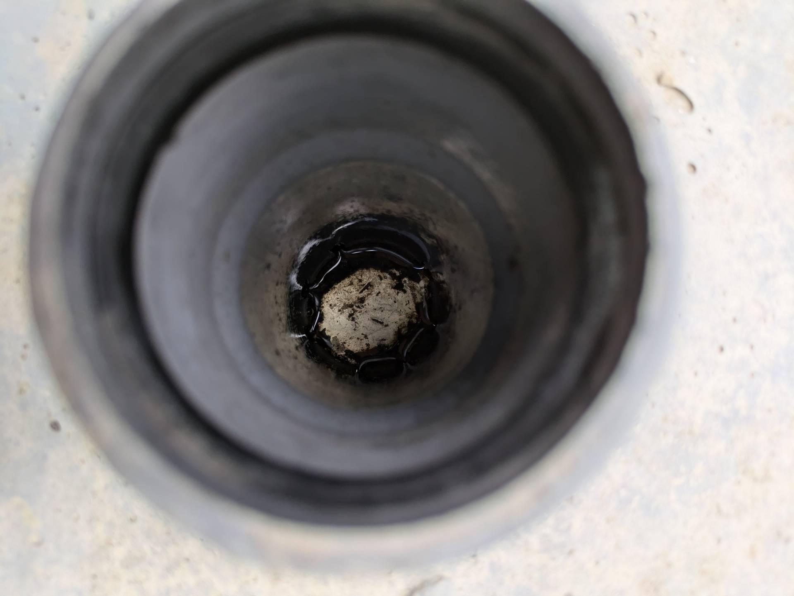

2024-07-12
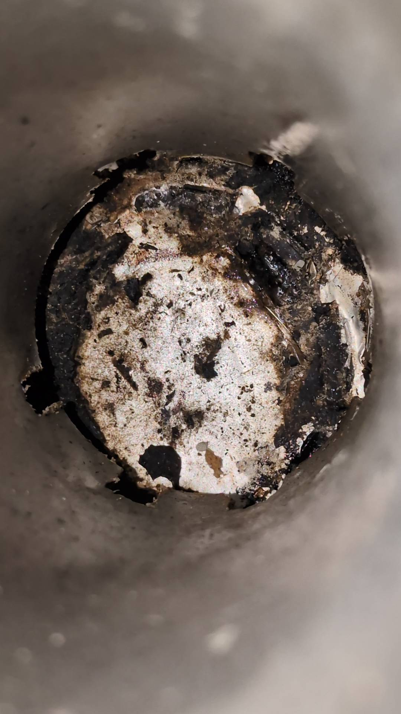

2024-09-11
