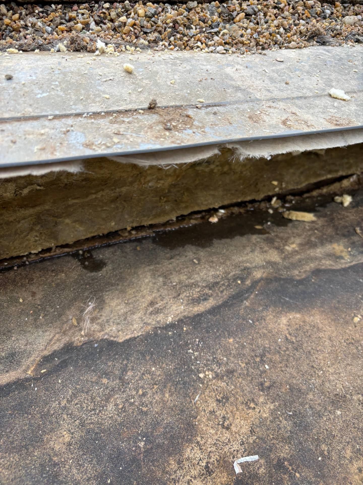
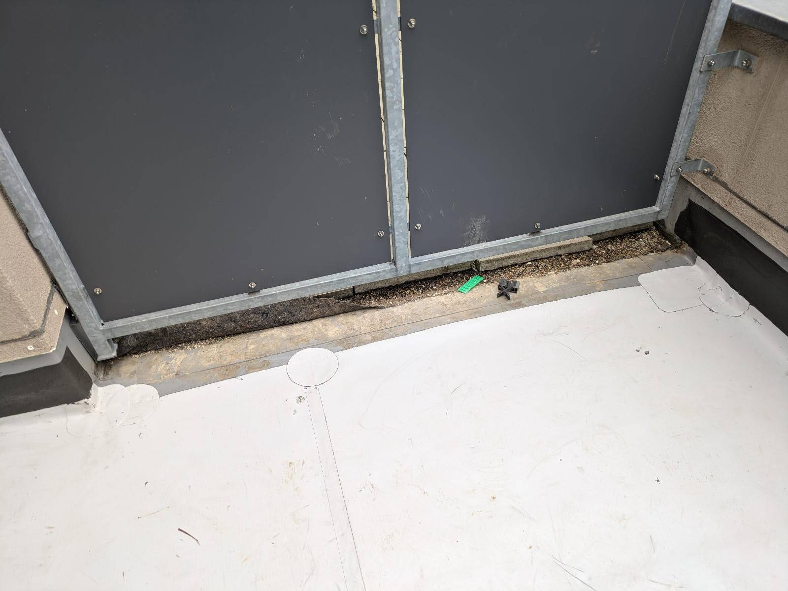

# A17 &ndash; Wasserschaden 1.OG via Regenablauf & Dachterrasse (Haus 10)

_Bauträger Vorgangsnummer: 8424-0332 (16.12.2022) und 8424-0404 (13.11.2024)_

_[&lt; zurück](../../index.md)_



## Stand 25.06.2025

Die Trocknungsgeräte wurden wieder abgebaut. Der Innenbereich schien wohl akzeptabel trocken zu sein.

An der Dachterrasse wurde weiterhin nicht gearbeitet.
Die Dämmwolle der Dachterrasse ist weiterhin durchnässt und es ist davon auszugehen, dass Wasser in der Dämmschicht ist.

## Stand 22.11.2024

Eine Trocknungs-Firma hat Trocknungensgeräte und eine Heizplatte im Innenbereich installiert.
An der Dachterrasse wurde weiterhin nicht gearbeitet.

## Stand 19.11.2024

Der Bauträger wurde erneut per E-Mail informiert.

## Stand 13.11.2024

Erneut Schimmel im gleichen Zimmer an der Fensterfront und Decke.
Es wurde außerdem nachgewiesen, das die Dämmwolle der Dachterrassen zwischen Haus 9+10 durchnässt ist.

Es wurde ein Schott zwischen Haus 9+10 installiert (Dachterrassen 8+9 wurden zu dem Zeitpunkt saniert) und die Dachterrasse (zu Haus 9) wurde wieder verschlossen.

Die Dämmung der Dachterrasse von Haus 10 wurde **nicht** ausgetauscht, die Dachterrasse wurde nicht geöffnet, und es ist anzunehmen, dass sich auch in der Dämmschicht und den Dämmplatten Wasser befindet!

Dämmwolle durchnässt zwischen Dachterrassen 9 und 10:

Dachterrasse 9 wieder verschlossen (ohne weitere Arbeiten an Dachterrasse 10):

## Stand 2023

Am Regenabfluss der Dachterrasse wurde gearbeitet. Leider ist nicht bekannt,
was genau das Problem war und was gemacht wurde.

Im Innenbereich war es zwischenzeitlich akzeptabel trocken.
Eine professionelle Trocknung hat nicht stattgefunden.

## Beschreibung

16.12.2022: Bei Haus 10 hat sich im 1.OG Schimmel an der Wand in Richtung Dachterrasse gebildet, die Wand war feucht.
Grund war offensichtlich Wassereintritt am Regenabfluss der Dachterrasse.

Der Bauträger hat hier "etwas korrigiert". Regenlaufspuren unter dem Regenwasserablauf sind weiterhin ersichtlich.

Im Folgenden trat Schimmel und Feuchtigkeit weiter auf (siehe Historie oben).
