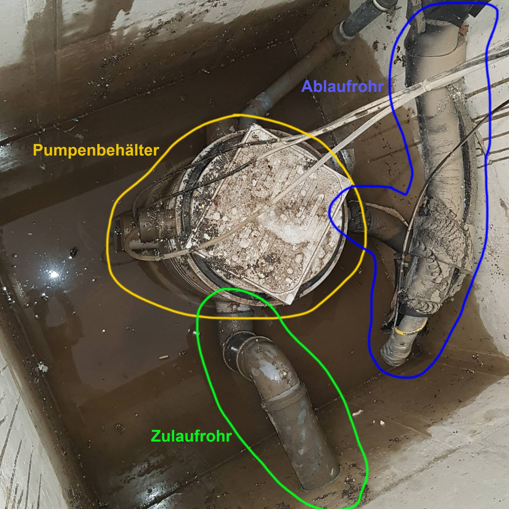
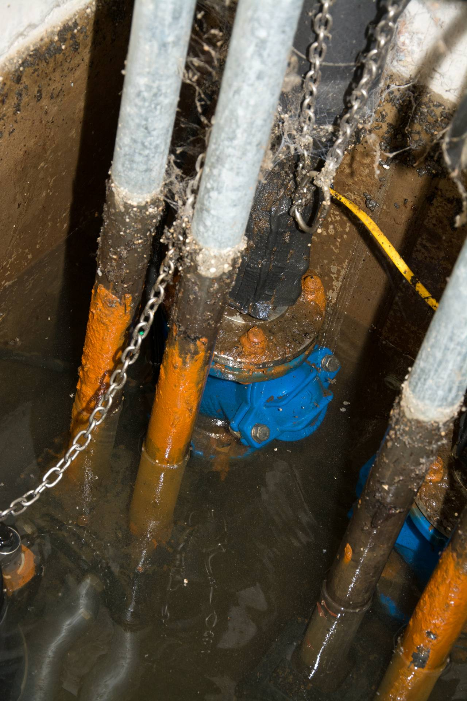
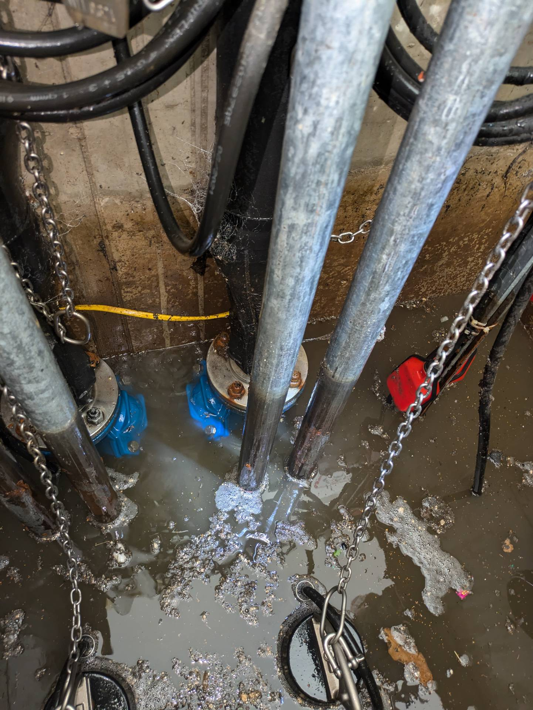

# A1 &ndash; Hebepumpe ausgetauscht, aber keine Betonversiegelung

_[&lt; zurück](../../index.md)_



## Ursprünglicher Meldungstext

> Status: gemeldet 2020\
> Raum: Tiefgarage\
> Beschreibung: Hebeanlage Tiefgarage unterdimensioniert und mangelhaft eingebaut (Flexible Schläuche statt festes Rohr; keine Auftriebsicherung; …)\
> -> Pumpen gegen größere ausgetauscht. Förderleistung gut. Auffangbehälter aus Kunststoff entfernt. WU-Beton wird direkt mit Fzg.-Betriebsmitteln und Salzen beaufschlagt. Bewährung wird sich üerb die Zeit zersetzen. Teile der neuen Hebeanlage sind aus verzinktem Stahl. Dieser rostet massiv an den dauerhaft unter Wasser stehenden teilen. Technisch mangelhafte Ausführung.\
> Frist: 31.03.2021

## Weitere Historie

Die Pumpe wurde inzwischen ausgetauscht durch zwei leistungsstärkere Pumpen.

Allerdings sieht das neue Pumpenkonzept vor, dass der Schacht dauerhaft unter Wasser steht. Die alte Pumpe hatte einen Behälter, in den Wasser eingeleitet wurde. Der Schacht sollte kein Wasser enthalten (hätte die Pumpe korrekt funktioniert). Siehe [Foto](#fotos-alte-pumpe) vom 17.08.2020 mit Markierungen.

Durch das neue Konzept sind die Betonwände dauerhaft Schmutzwasser, z.B. mit Streusalz, ausgesetzt. Der Beton ist unseres erachtens nach nicht durch eine Beschichtung geschützt. Dies hat mutmaßlich zur Folge, dass der Beton auf Dauer geschädigt wird.

[Bauträger EMail (14.07.2024)]:

> Punkt A1: Bauträger prüft und gibt Rückmeldung erfolgt – 
> Gemäß Rückmeldung des Nachunternehmers liegt an der aktuellen Ausführung der Hebeanlage kein Mangel vor. Somit besteht unsererseits kein Handlungsbedarf.

- _Siehe außerdem_ [_Zulaufrohr dauerhaft unter Wasser (A1B)_](../A1B/index.md)
- _Siehe außerdem_ [_Montageteile Hebepumpe korrodieren (A1C)_](../A1C/index.md)

## Fotos **alte** Pumpe

2020-08-17 (vorherige Pumpe!)

2020-08-17 (vorherige Pumpe!)

## Fotos **neue** Pumpen

2024-08-27 (neue Pumpen)

2024-08-27 (Zulaufrohr)

### Fotos nach manuellem senken des Wasserspiegels:

2024-08-27 (Beim Ablassenn schießt 1-3 Minuten Wasser aus dem Rohr)

2024-08-27 (braune Ablagerungen)

2024-08-27 (braune Ablagerungen)

2024-08-27 (braune Ablagerungen)

### Fotos nach Reinigung:

2024-08-28 (nach Reinigung der Rohre)

2024-08-28 (nach Reinigung - Rost oder Ablagerung?)

[Bauträger EMail (14.07.2024)]: https://drive.google.com/file/d/19hDpQ9SWxaemkfX0wXpxzCk9p0P5WIK4/view?usp=drive_link
