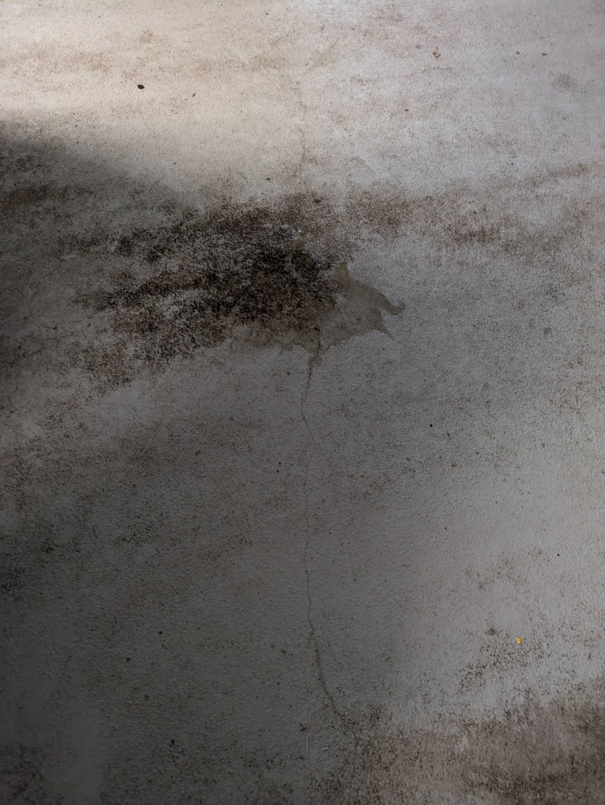

# A19 &ndash; Risse in OS8 Beschichtung Tiefgarage

_[&lt; zurück](../../index.md)_



In der Tiefgarage bilden sich Risse in der OS8-Beschichtung.
Das ist normal nach einiger Zeit, muss allerdings bei der Wartung
repariert werden. Die Verantwortung liegt bei der WEG.

Bei der letzten Wartung wurden die Risse als nicht kritisch
identifiziert.

## Fotos

2024-07-27
