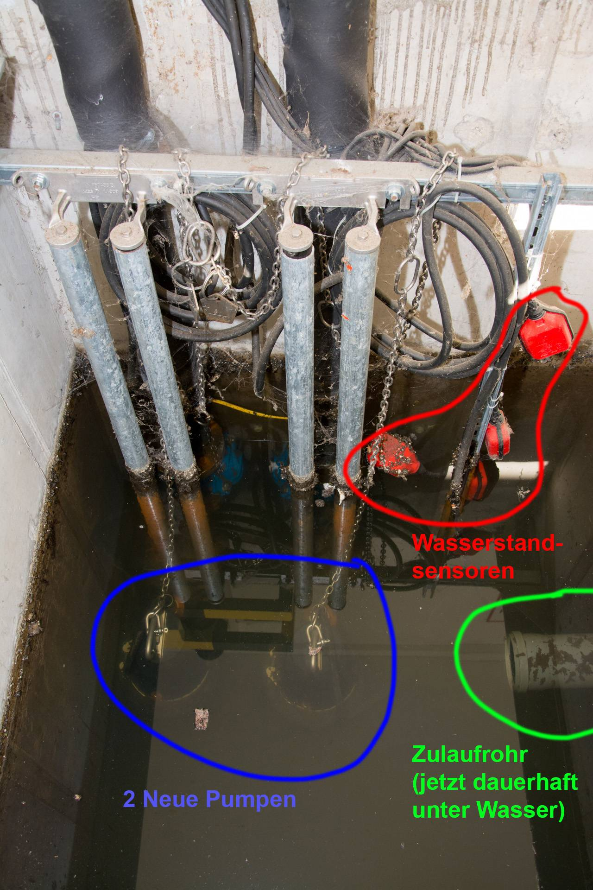

# A1B &ndash; Zulaufrohr zur Hebepumpe steht nun dauerhaft unter Wasser

_[&lt; zurück](../../index.md)_



Aufgrund des Pumpenwechsels ([siehe A1](../A1/index.md)) steht der Schacht nun dauerhaft unter Wasser.
Das hat zur Folge, dass das Zulaufrohr zur Pumpe und alle Verzweigungen unter der Wasserlinie nun ebenfalls dauerhaft mit Wasser gefüllt sind.
Wird der Wasserspiegel manuell gesenkt schießt 1-3 Minuten Wasser aus dem gefüllten Rohr.
Siehe [Video](https://www.youtube.com/watch?v=iycllwZGXN0).

Unsere Vermutung ist, dass dies auf Dauer zu verstärkten Ablagerungen in den Rohren führen wird und ggf. noch andere negative Folgen haben könnte.

Es ist zu klären, ob dies so in Ordnung ist und welche Gegenmaßnahmen vom Bauträger u.U. erforderlich sind.\
Eine Möglichkeit könnte sein, die Wasserstandssensoren tiefer zu platzieren, sodass das Rohr freiliegt. Dies ist mit dem Hersteller zu klären.

- _Siehe außerdem_ [_Keine Betonversiegelung (A1)_](../A1/index.md)
- _Siehe außerdem_ [_Montageteile Hebepumpe korrodieren (A1C)_](../A1C/index.md)

## Fotos

2024-08-27 (neue Pumpen - System sieht vor, dauerhaft unter Wasser)

2024-08-27 (Zulaufrohr dauerhaft unter Wasser)

2024-08-27 (Beim manuellen Senken des Wasserspiegels schießt 1-3 Minuten Wasser aus dem Rohr)

