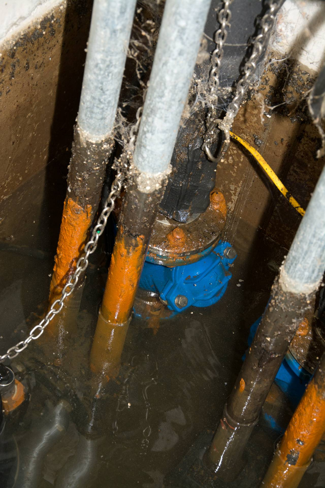
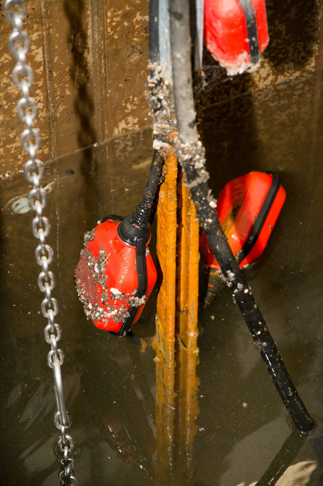
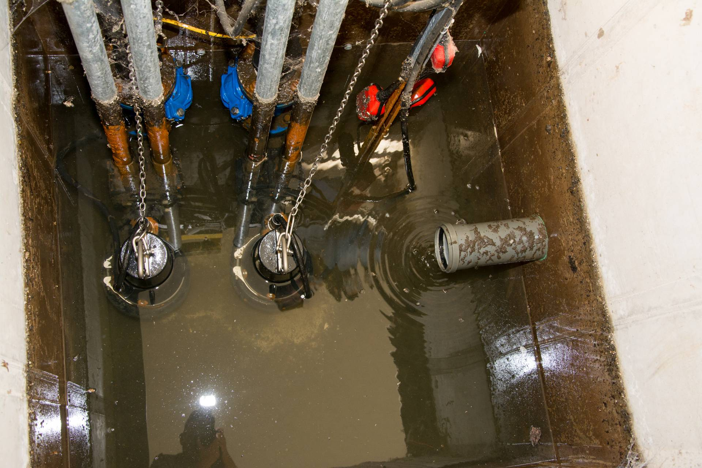
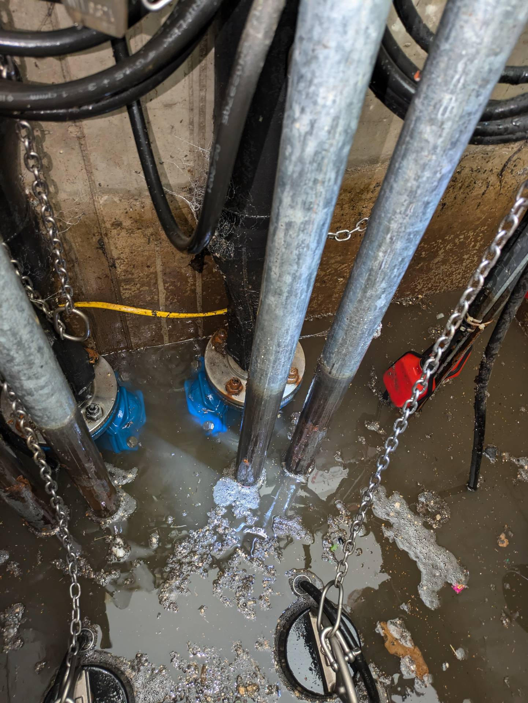
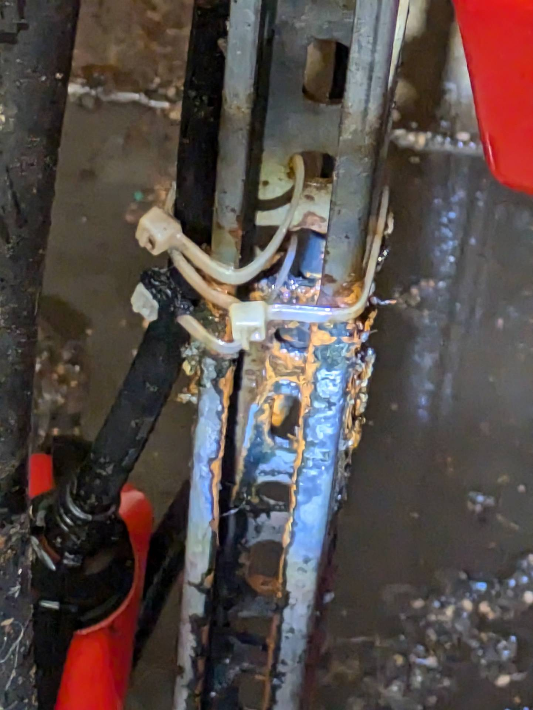

# A1C &ndash; Montageteile Hebepumpe korrodieren

_[&lt; zurück](../../index.md)_



Aufgrund des Pumpenwechsels ([siehe A1](../A1/index.md)) steht der Schacht nun dauerhaft unter Wasser.

Unter Umständen sind einige der Teile der neuen Pumpen nicht korrosionsicher, es bildet sich eine Braune Schicht an den Metallteilen unter Wasser.\
Es ist (auch nach einer Reinigung - siehe Fotos) nicht eindeutig ersichtlich, ob es sich um Rost handelt, oder woher diese Ablagerung kommt und ob sie problematisch ist.

- _Siehe außerdem_ [_Keine Betonversiegelung (A1)_](../A1/index.md)
- _Siehe außerdem_ [_Zulaufrohr dauerhaft unter Wasser (A1B)_](../A1B/index.md)

## Aktueller Stand

Es scheint als ließe sich die braune Schicht mit Wasserdruck entfernen.
Vermutlich rostet nicht das Metall selbst.

## Fotos

2024-08-27 (braune Ablagerungen)

2024-08-27 (braune Ablagerungen)

2024-08-27 (braune Ablagerungen)

2024-08-28 (nach Reinigung der Rohre)

2024-08-28 (nach Reinigung - Rost oder Ablagerung?)
