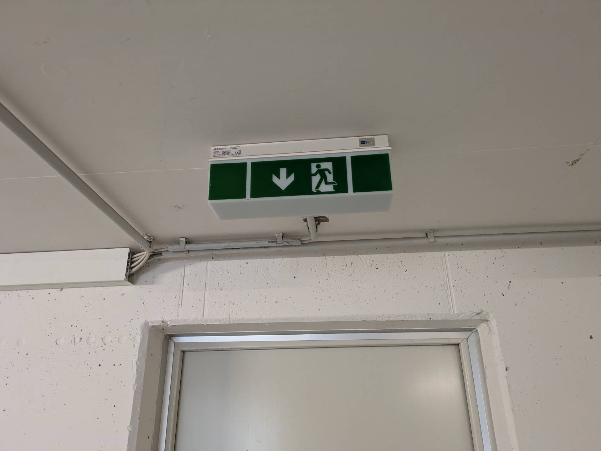
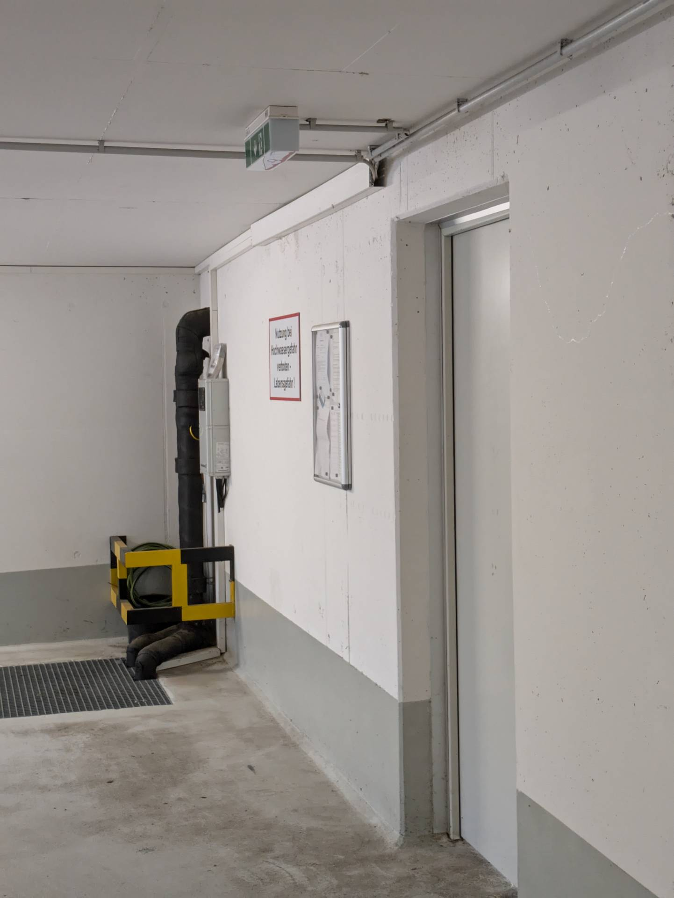

# A21 &ndash; Notausgang Schilder schlecht sichtbar und nicht beleuchtet

_[&lt; zurück](../../index.md)_



Alle 3 Notausgangschilder sind nicht beleuchtet, obwohl Kabel zu den Schildern führen.

Im Nordbereich sind die Schilder außerdem nicht von allen Stellen gut sichtbar. Das Notausgangschild in der Nähe vom Rolltor sollte um 90° gedreht werden.

(Wurde von Gutachterin bemängelt)

## Fotos

2024-09-11

2024-09-11
