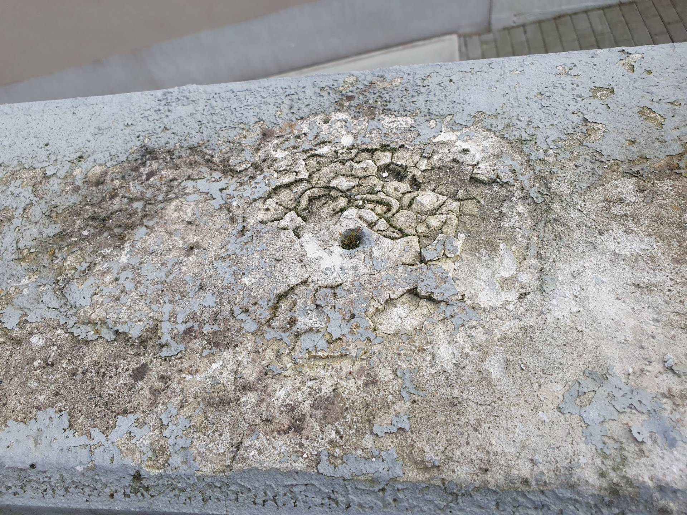
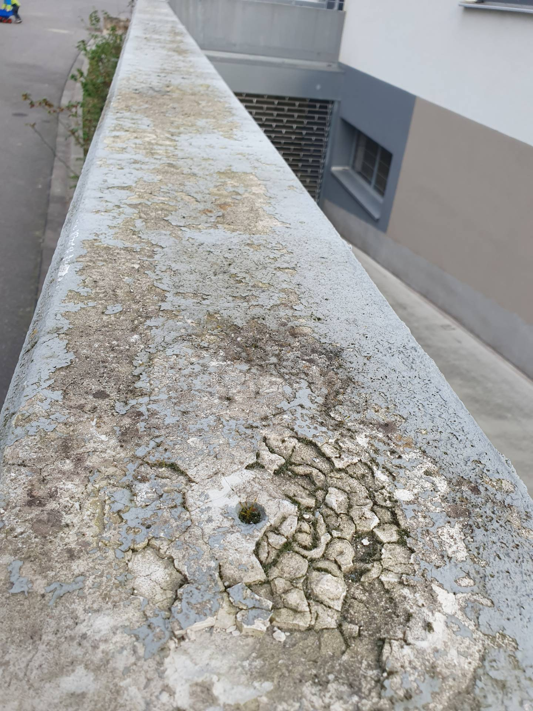
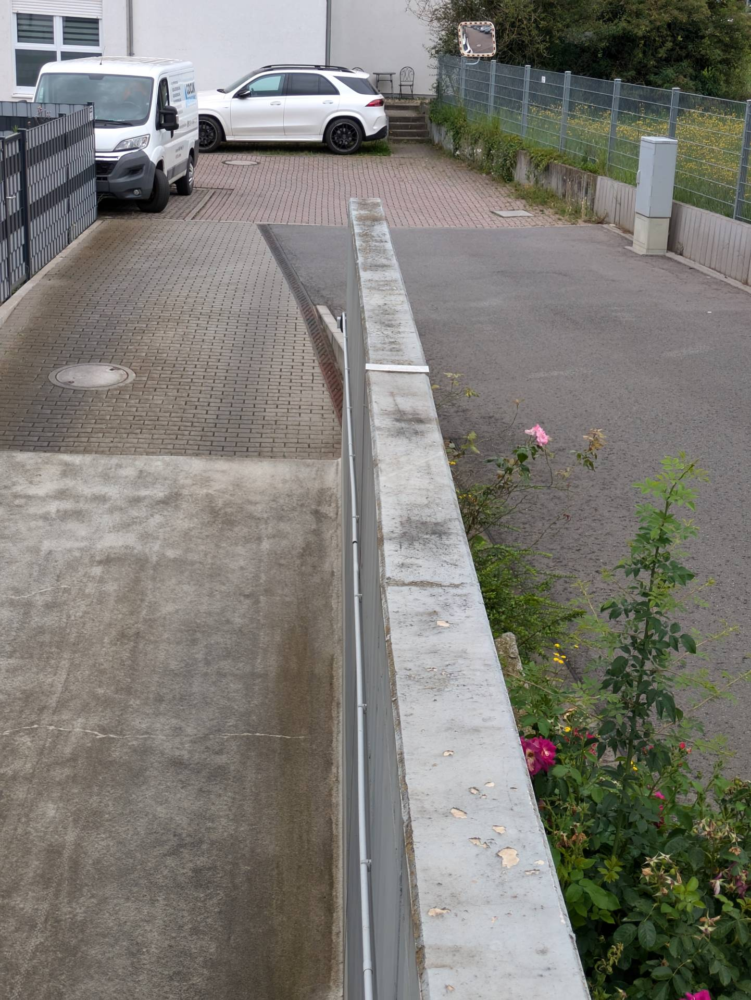
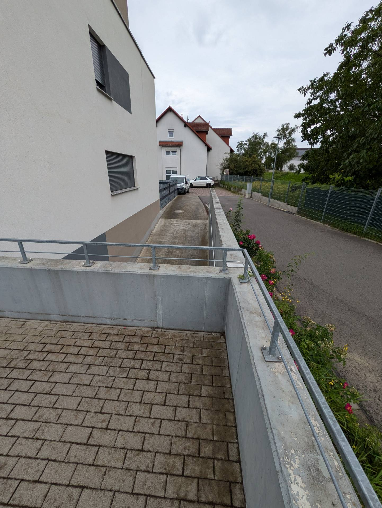
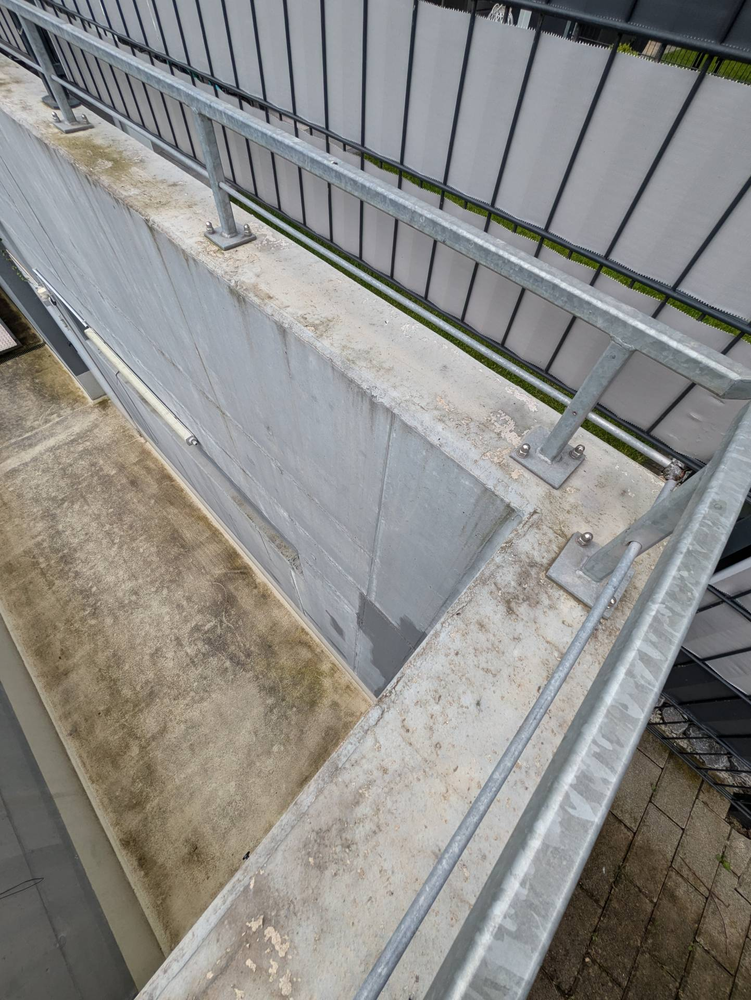

# A5 &ndash; Schutz gegen Schlagregen/Bewitterung auf Betonmauern fehlt

_[&lt; zurück](../../index.md)_



## Ursprünglicher Meldungstext

> Status: offen,\
> Raum: Oberflächen der Betonmauern im Außenbereich TG Nord\
> Beschreibung: Schutz gegen Schlagregen/Bewitterung fehlt. Erste Mängel an Betonoberflächen treten auf.

## Weitere Historie

Der Maler des Bauträgers meinte, es wäre nicht Beton der abbröckelt,
sondern Gips oder so, der in die Löcher geschmiert wurde.
Der Beton würde der Witterung standhalten.
Lediglich der Anstrich blättert ab, weshalb er gar nicht gestrichen hätte.

Wir haben uns aber auch gefragt, warum der Beton auf der Mauer so
abgenutzt aussieht, während z.B. Tiefbordsteine daneben fast wie neu aussehen.

### 11.09.2024

Die Gutachterin meinte, der Beton muss nicht extra geschützt werden.
Allerdings blättert die Farbe ab und sollte erneuert werden. Die Farbschicht bildet auch eine Art von Schutz.

## Fotos

2024-03-09

2024-03-09

2024-06-22

2024-06-22

2024-06-22

