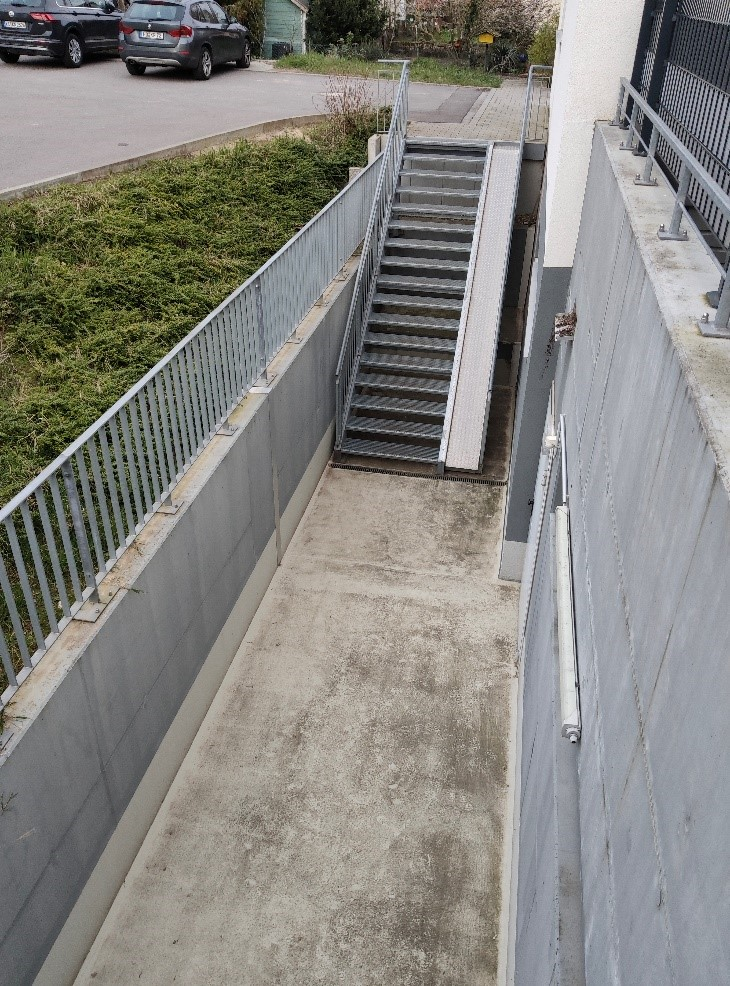
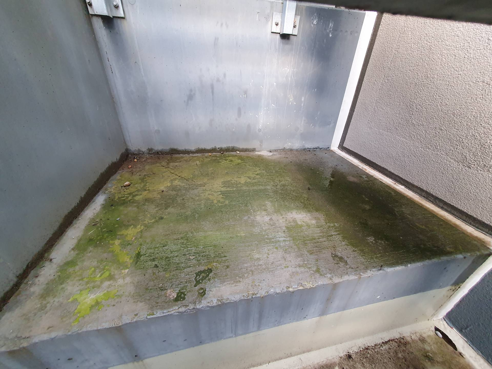
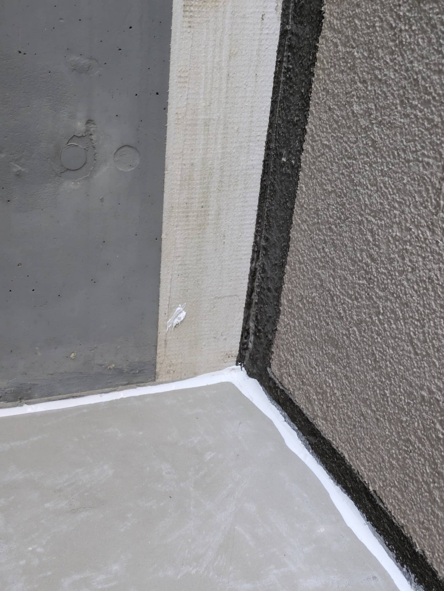
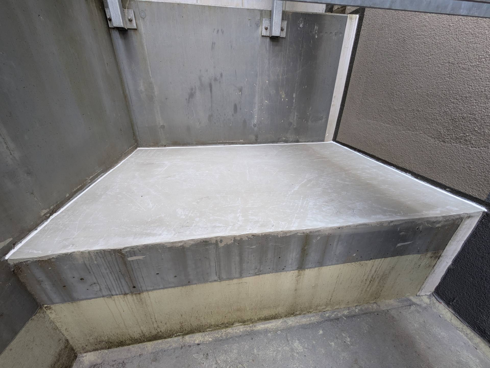
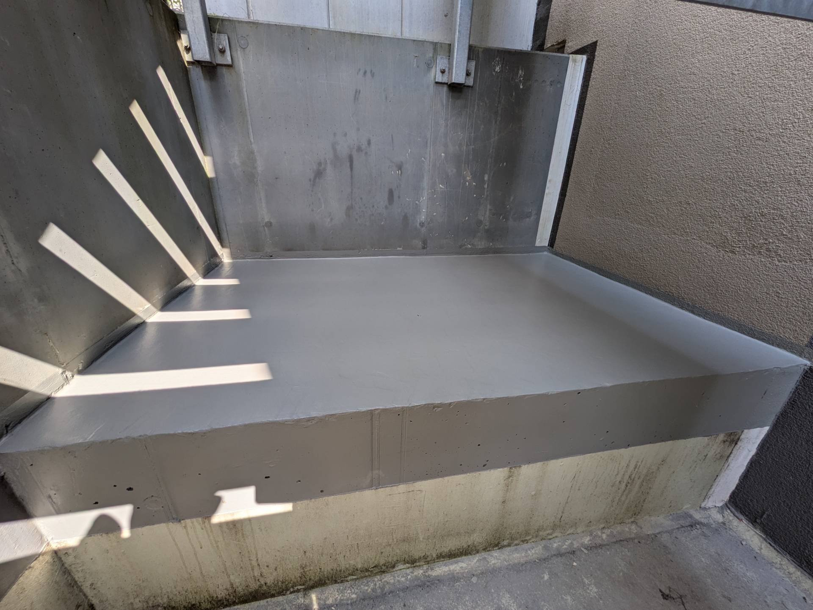

# A2 &ndash; Unter Treppe Tiefgarage Schlagregen, Wasser bleibt stehen. Moosbildung.

_[&lt; zurück](../../index.md)_



## Ursprünglicher Meldungstext

> Status: offen, nicht gemeldet\
> Raum: Abgang TG Nord\
> Beschreibung: unter Treppe Tiefgarage Schlagregen, Wasser bleibt stehen. Moosbildung. Gefälle sollte hergestellt werden.\

## Weitere Historie

Am 18. und 19. Juli 2024 wurde die untere Fläche mit Gefälle versehen und mit Disbon 404 ELF 1K-Acryl Bodensiegel versiegelt.

An der oberen Ebene unter der Treppe wurde nichts gemacht. Hier ist weiterhin Punkt [A2B](../A2B/index.md) offen.

## Fotos

2023-09-01

2024-07-18

2024-07-18

2024-07-19
