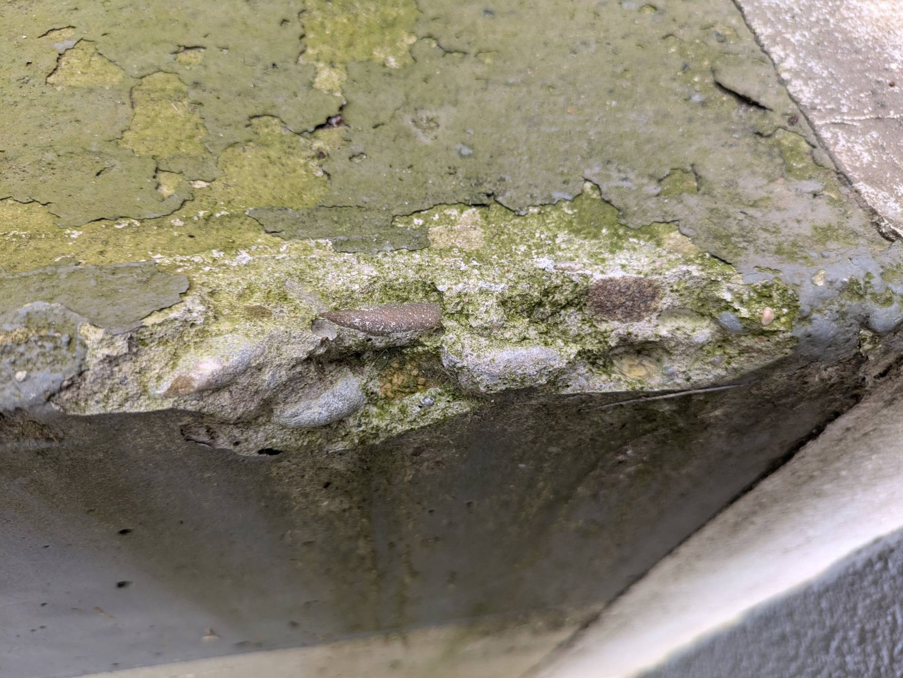
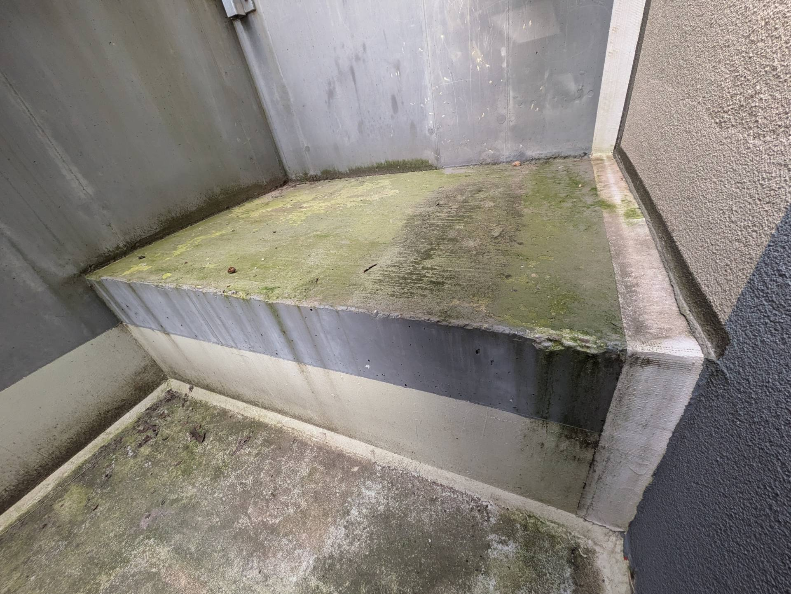
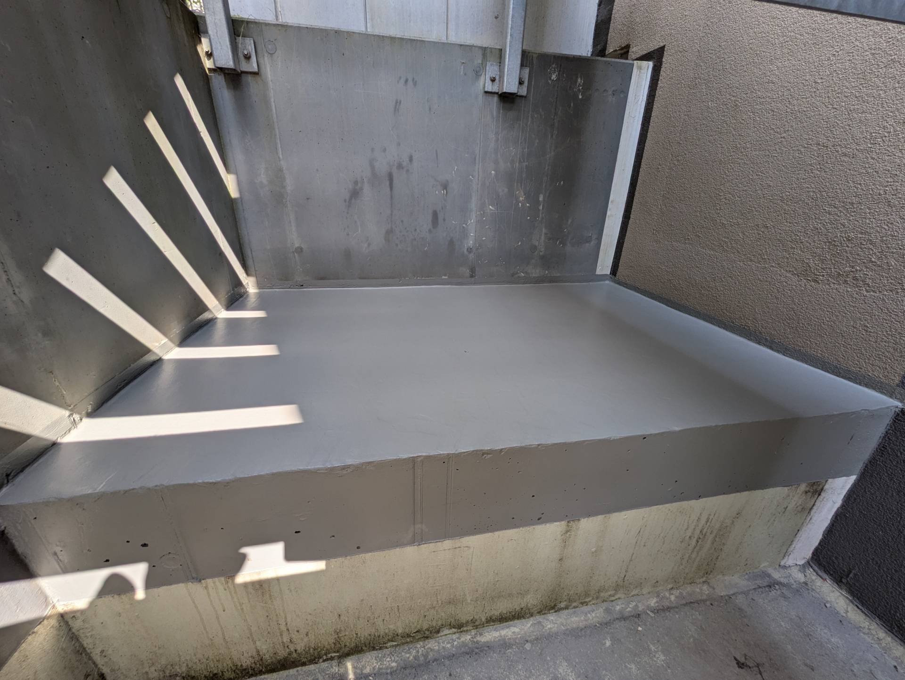

# TG Treppe Nord - Bewährungsstahl liegt frei

_[&lt; zurück](../../index.md)_



Unter der Treppe zur Tiefgarage Nord bröckelte aufgrund fehlendem Schutzes gegen Witterung und Schlagregen der Beton und Bewährungsstahl lag frei.

Dies wurde inzwischen im Rahmen von [A2](../A2/index.md) behoben.

## Fotos

2024-06-09

2024-06-09

2024-07-19

