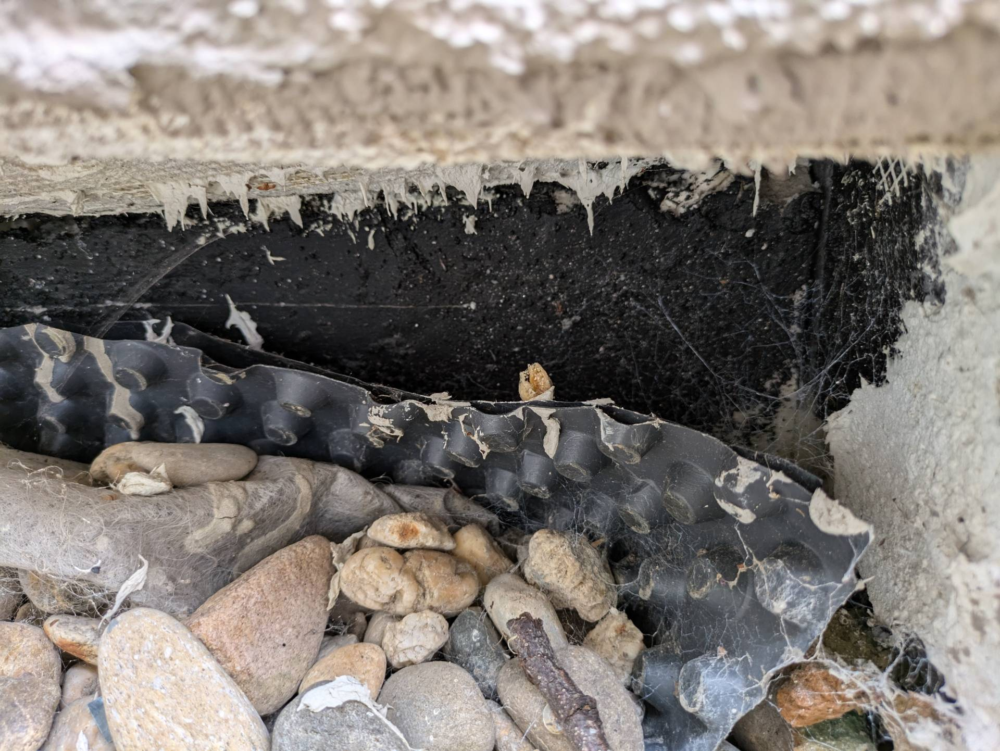
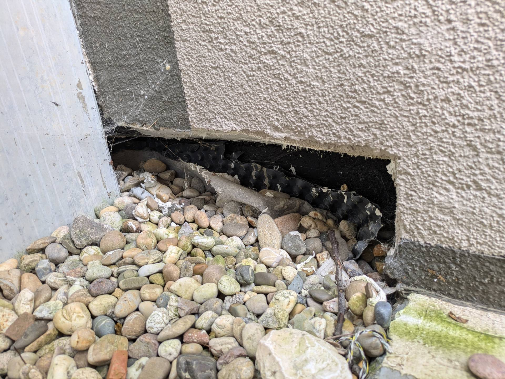

# A2C &ndash; TG Treppe Nord - Dämmung ungeschützt, Wassereintritt

_[&lt; zurück](../../index.md)_



Bei Haus 8 sind oft die Wände im Keller feucht. Die Vermutung liegt Nahe, dass dies an den beiden Absätzen unter der Treppe zur Tiefgarage Nord liegt. Auf dem unteren Absatz hat sich oft Wasser gestaut, sodass der Bauträger mehrfach abgedichtet und inzwischen auch ein Gefälle hergestellt hat (siehe [A2](../A2/index.md)).

Der obere Absatz ist mit Steinen befüllt und hat eine Öffnung in der Dämmung welche Wassereintritt ermöglicht. Die Betonwand scheint mit einer Schutzschicht versehen zu sein, aufgrund der Feuchtigkeitsprobleme könnte aber auch hier ein Problem vorliegen.

Desweiteren ist fragwürdig, warum WU-Beton feucht werden kann!? Ist der WU-Beton mangelhaft (Risse oder ähnliches)?

## Fotos

2024-06-09

2024-06-09
