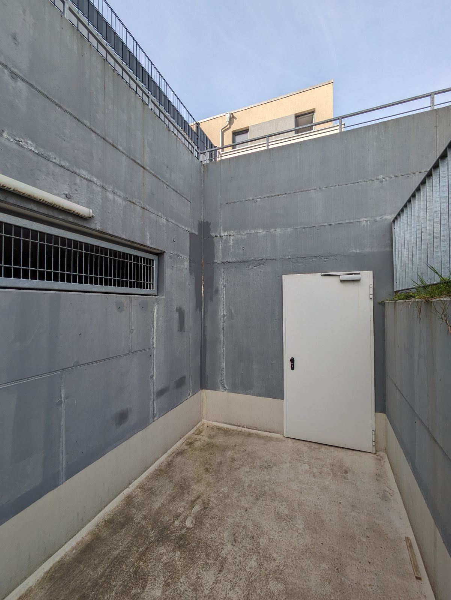
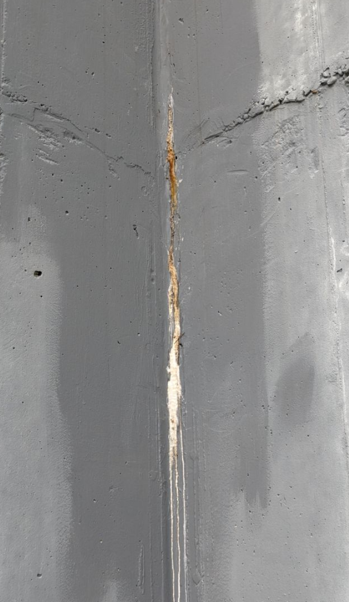
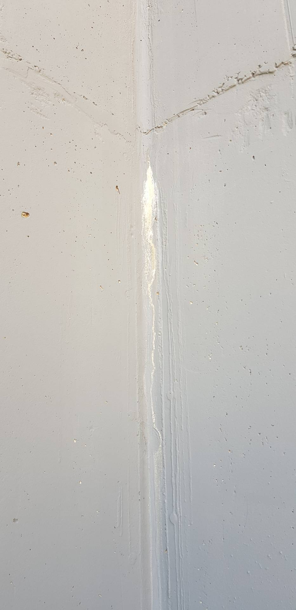
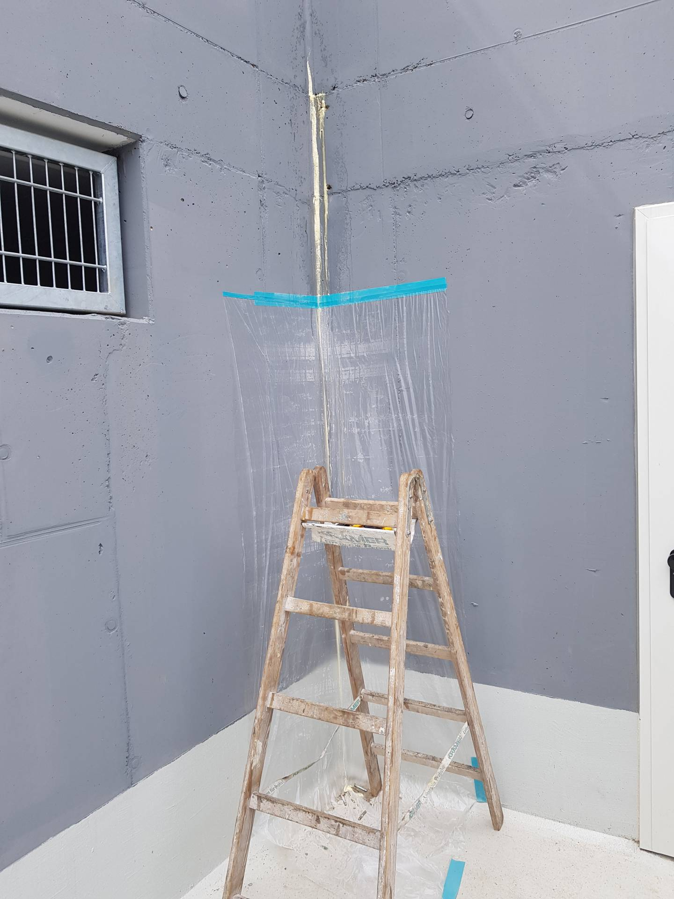
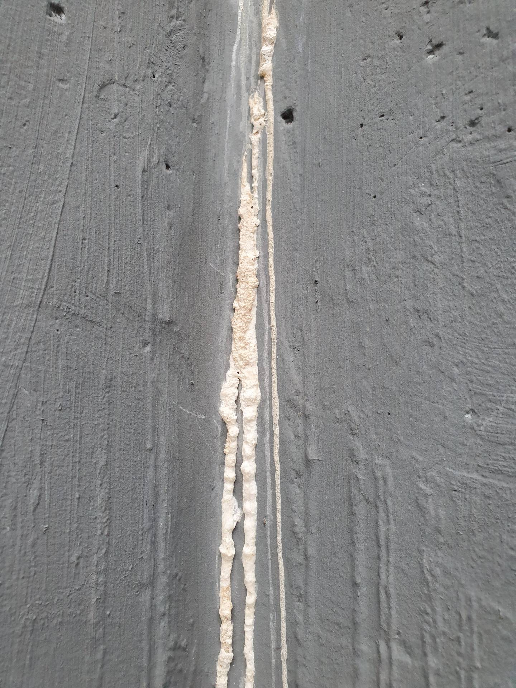
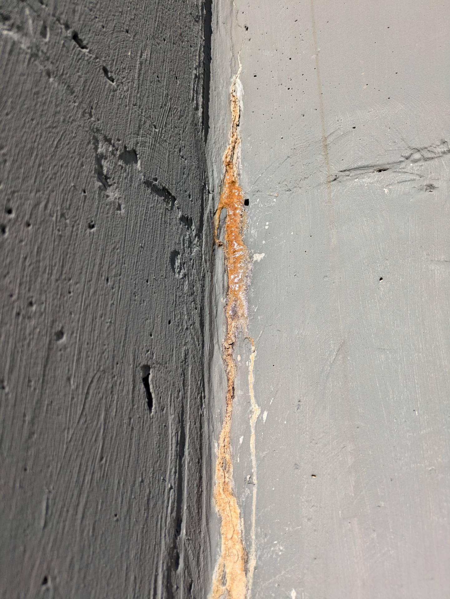
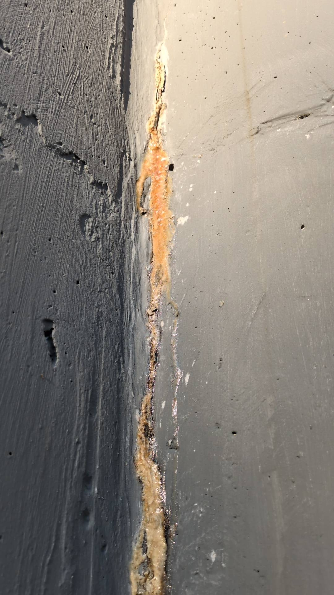
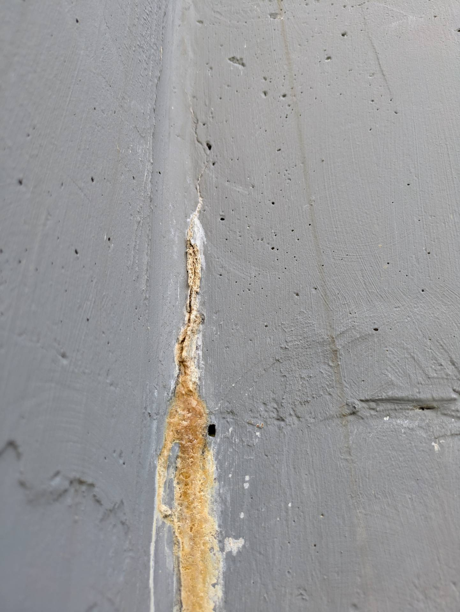
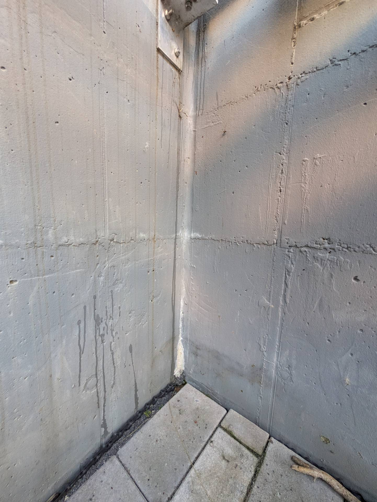
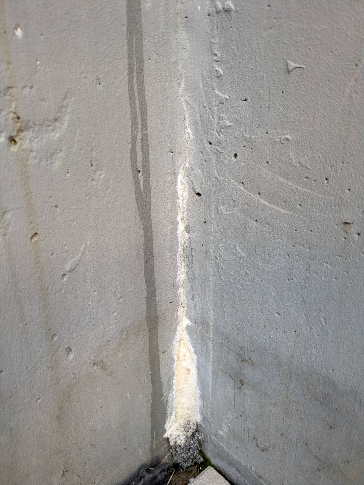

# A3 &ndash; Undichte Betonwand. Auswaschungen/Kristalisierung in Mauerecken zu Garten Haus #8 und #13

_[&lt; zurück](../../index.md)_



## Aktueller Stand (08.08.2024)

Sowohl am Nord- als auch am Südende der Tiefgarage tritt weiterhin eine weiß-bräunliche
Masse durch Risse in den Betonecken in etwa auf Höhe der Tiefgaragendecke (am Südende etwas tiefer, am Nordende etwas höher).

Am Nordende wurde am 13.05.2020 etwas in den Beton gespritzt und die Stelle
(mit deutlich abweichender Farbe) gestrichen. Seither ist aber weiterhin Masse
aus dem Beton ausgedrungen.

## Ursprünglicher Meldungstext

> Status: offen, bereits ein Abstellversuch, nicht nachgemeldet\
> Raum: Abgang TG Nord\
> Beschreibung: Auswaschungen/Kristalisierung in Mauerecke zu Garten Haus #8.\
> -> Bereits ein Abstellversuch unternommen. Vermutlich nur übermalt und nicht zusätzlich mit Dichtmaterial verpresst. Gleiche Auswaschungen traten wieder auf.

## Weitere Historie

Später wurde eine weitere Stelle, mit gleichem Schadensbild, an der gleichen Stelle am südlichen Ende der Tiefgarage im Garten von Haus 13 entdeckt (siehe [Fotos](#fotos-tg-süd)).

E-Mail Verkehr 22.07.2024:

> Frage Eigentümer:\
> "Sie wollten recherchieren bzgl. des weißen Materials, dass an den Ecken der Tiefgarage austritt (in Garten Haus 13 und am Tiefgaragenabgang Nord) und welche Maßnahmen erforderlich sind."
>
> Antwort Bauträger:\
> "Ich werde prüfen, ob Herr *** bereits recherchiert hat und ob ich hierzu etwas finden kann. Falls nicht, werde ich selbst nachschauen, ob Maßnahmen erforderlich sind."

### Gutachterin 11.09.2024 

Die Stellen auf beiden Seiten der Tiefgarage sollten erneut mit Hochdruck
verspritzt werden. Dabei ist es irrelevant von welcher Seite man das macht - außen ist also OK.
Offensichtlich hat war die erste Maßnahme nicht erfolgreich.

Wenn man das so lässt, wird der Beton im Winter durch das gefrierende Wasser immer weiter aufgesprengt.

## Fotos TG Nord

2020-04-23

2020-05-13

2022-03-15

2024-06-11

2024-07-29

2024-08-02

## Fotos TG Süd

2024-08-06

2024-08-06

