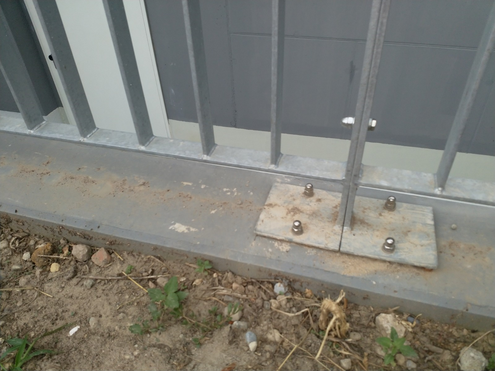
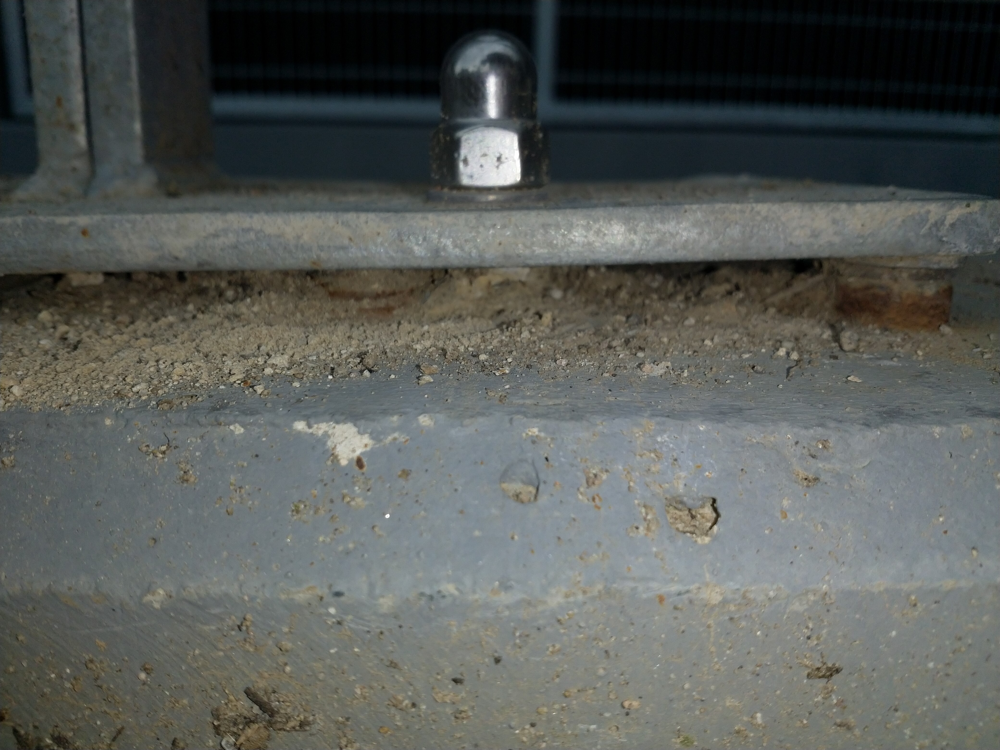

# H &ndash; Abdichtung Geländeranschlüsse TG Nord fehlen

_[&lt; zurück](../../index.md)_



## Ursprünglicher Meldungstext

> Status: Neu (Nach Abnahme); nicht erledigt\
> Raum: Treppenabgang Tiefgarage Nord\
> Beschreibung: Abdichtung Geländeranschlüsse TG Nord fehlen. Anbringung Geländer nicht nach Regeln der Technik. Eindringen von Niederschlagswasser in Geländeranschlüsse möglich.\
> Frist: 31.03.2021

## Update 11.09.2024

Die Gutachterin meinte, hier ist keine weitere Abdichtung notwendig.
Es kann eigentlich kein Wasser in die Schraublöcher eindringen und wenn dann nur sehr gering.

## Fotos

